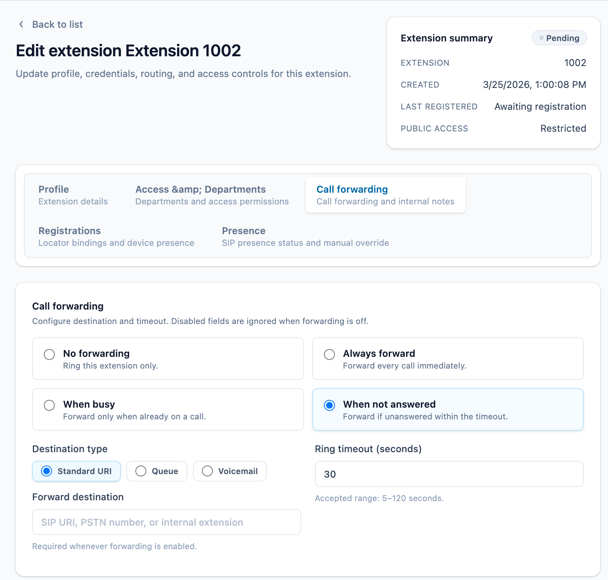
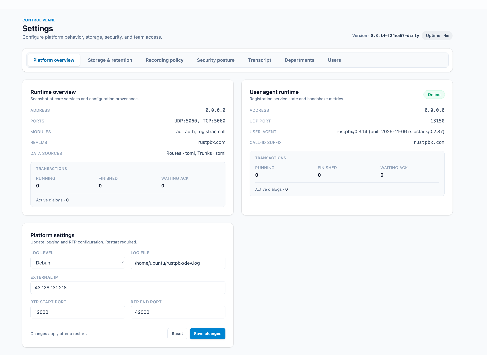
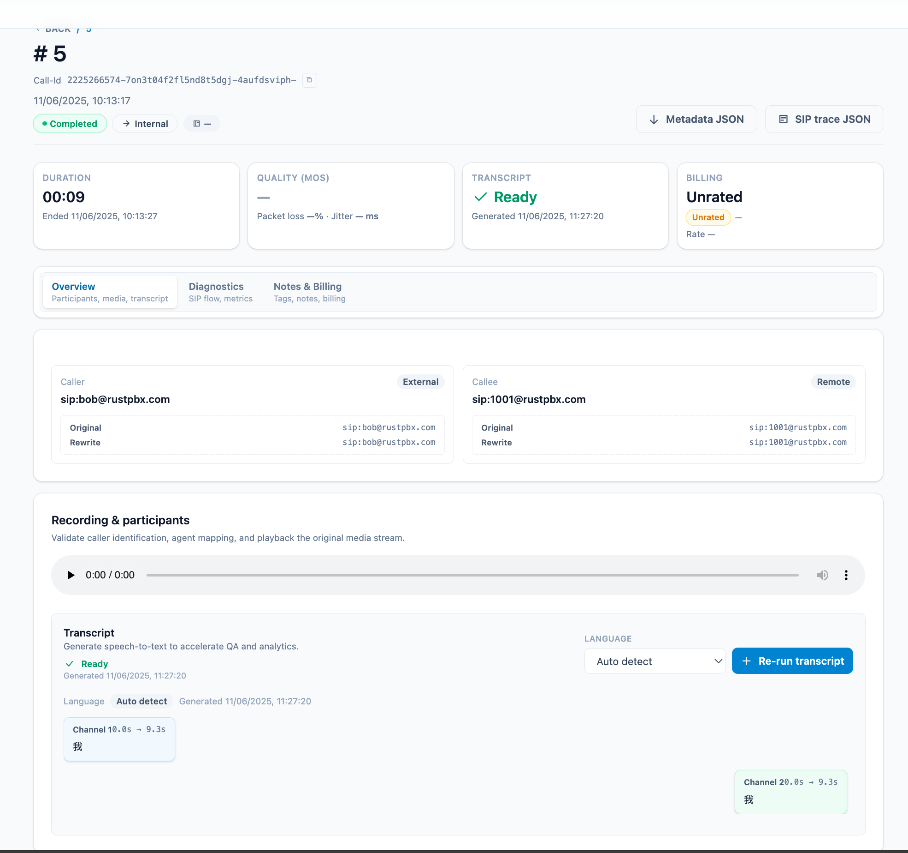
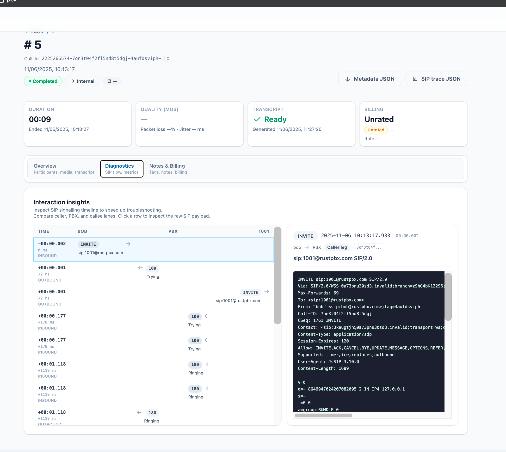
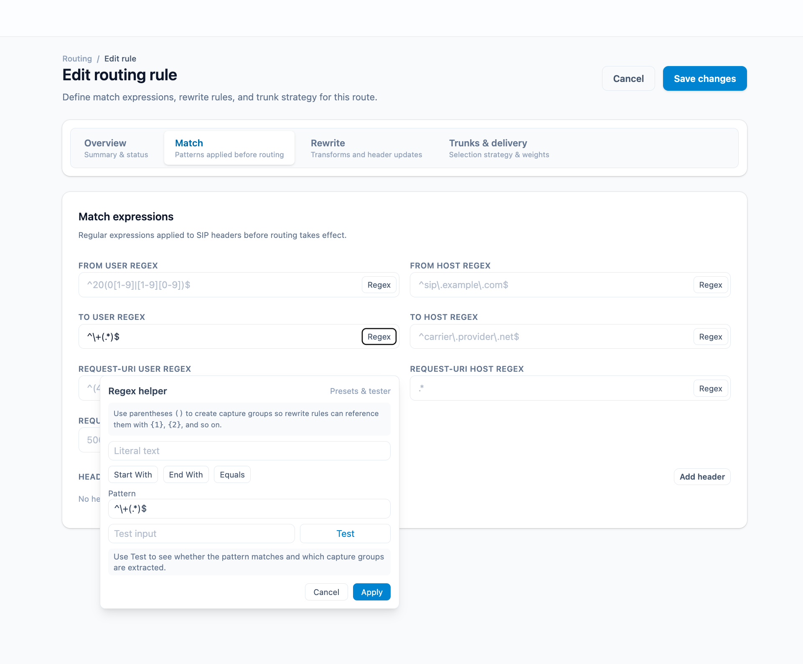
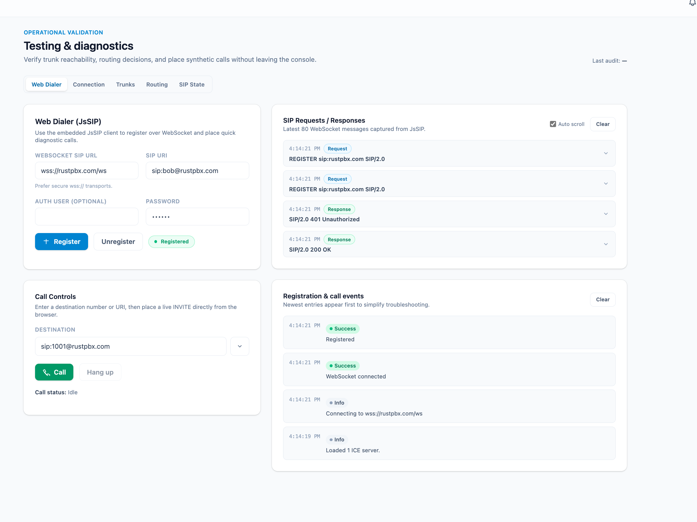
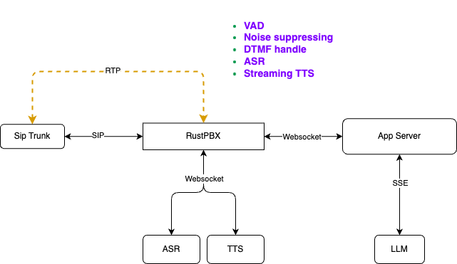
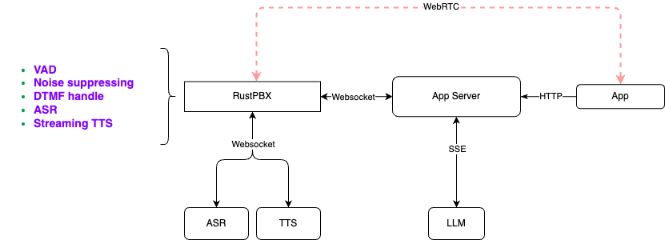

# RustPBX - AI-Powered Software-Defined PBX

[](https://deepwiki.com/restsend/rustpbx)

RustPBX is a high-performance, secure software-defined PBX (Private Branch Exchange) system implemented in Rust, designed to support AI-powered communication pipelines and modern voice applications.

## 🚀 Key Features

### SIP PBX Core
- **Full SIP Stack**: Complete SIP proxy server with registration, authentication, and call routing
- **Media Proxy**: Advanced RTP/RTCP media proxying with NAT traversal support
- **Multi-Transport**: UDP, TCP, and WebSocket transport support
- **Call Recording**: Built-in call recording with multiple storage backends
- **User Management**: Flexible user authentication and registration system

### AI Voice Agent Services
- **Speech-to-Text (ASR)**: Real-time speech recognition with multiple providers (Tencent Cloud, Aliyun, Deepgram)
- **Text-to-Speech (TTS)**: High-quality speech synthesis with emotion and speaker control
- **LLM Integration**: OpenAI-compatible LLM proxy for intelligent conversation handling
- **Voice Activity Detection**: WebRTC and Silero VAD and Ten VAD support for optimal speech processing
- **Noise Suppression**: Real-time audio denoising(rnnoise) for crystal-clear conversations

### RESTful API & WebSocket
- **RESTful Endpoints**: Complete REST API for call management and control
- **WebSocket Commands**: Real-time call control via WebSocket connections
- **Call Management**: List, monitor, and control active calls

## 🛠 Quick Start

### Prerequisites
- Rust 1.75 or later
- Cargo package manager
- `pkg-config`, `libasound2-dev`, `libopus-dev`

Linux:
```bash
apt-get install -y libasound2-dev libopus-dev
```

macOS:
```bash
brew install opus
```

### Install & Build
```bash
git clone https://github.com/restsend/rustpbx
cd rustpbx
cargo build --release
```

> For a minimal footprint you can disable heavy features: 
> `cargo build -r --no-default-features --features vad_webrtc,console`

### UserAgent Quick Start (Browser LLM voice demo)
1. Create a lightweight UA configuration (`config.ua.toml`) that exposes the WebRTC console and proxies LLM traffic:
  ```bash
  cat > config.ua.toml <<'EOF'
  http_addr = "0.0.0.0:8080"
  log_level = "info"
  [ua]
  addr = "0.0.0.0"
  udp_port = 13050
  EOF
  ```
2. Start RustPBX in UA mode and serve the console assets:
  ```bash
  cargo run --bin rustpbx -- --conf config.ua.toml
  ```
3. Open `http://localhost:8080` → **WebRTC Interface**. Under **LLM** select your model, toggle streaming if needed, and click **Start Session**. You can now hold a full duplex voice conversation with the LLM through your browser.

### PBX Quick Start (SQLite + console admin)
1. Create a PBX configuration (`config.pbx.toml`) pointing to SQLite and enabling call records:
  ```bash
cat > config.pbx.toml <<'EOF'
http_addr = "0.0.0.0:8080"
log_level = "debug"
#log_file = "/tmp/rustpbx.log"
recorder_path = "/tmp/recorders"
# recorder_format can be "wav" (default) or "ogg" (requires enabling the 'opus' feature)
recorder_format = "ogg"
media_cache_path = "/tmp/mediacache"
database_url = "sqlite://rustpbx.sqlite3"

# external IP address for SIP signaling and media
# if server is behind NAT, set your public IP here (without port)
# external_ip = "1.2.3.4"

[console]
#session_secret = "please_change_me_to_a_random_secret"
base_path = "/console"
# allow self-service administrator signup after the first account
allow_registration = false

[proxy]
modules = ["acl", "auth", "registrar", "call"]
addr = "0.0.0.0"
udp_port = 15060
registrar_expires = 60
ws_handler= "/ws"
media_proxy = "auto"
# Base directory for generated routing/trunk/ACL files
generated_dir = "./config"
routes_files = ["config/routes/*.toml"]
trunks_files = ["config/trunks/*.toml"]

[proxy.transcript]
command = "sensevoice-cli"

# ACL rules
acl_rules = [
    "allow all",
    "deny all"
]
acl_files = ["config/acl/*.toml"]

[[proxy.user_backends]]
type = "memory"
users = [
    { username = "bob", password = "123456" },
    { username = "alice", password = "123456" },
]

[[proxy.user_backends]]
type = "extension"
database_url = "sqlite://rustpbx.sqlite3"

[callrecord]
type = "local"
root = "/tmp/recorders"

[recording]
enabled = true
auto_start = true

EOF
  ```
2. Launch the PBX:
  ```bash
  cargo run --bin rustpbx -- --conf config.pbx.toml
  ```
3. In a separate shell create your first super admin for the console:
  ```bash
  cargo run --bin rustpbx -- --conf config.pbx.toml \
    --super-username admin --super-password change-me-now
  ```
4. Sign in at `http://localhost:8080/console/`, add extensions, and register your SIP endpoints against `udp://localhost:15060`.
5. Verify call recordings and transcripts under **Call Records** once calls complete.

## Console Screenshots
### extensions

### call records

### settings

### call record with transcript

### call record with message flow

### route editor

### webrtc phone


## 🐳 Docker Deployment

### Quick Start with Docker

1. **Pull the Docker image:**
```bash
docker pull ghcr.io/restsend/rustpbx:latest
```
2. **Create config.toml:**
>  copy from config.toml.example

4. **Run with Docker:**
```bash
docker run -d \
  --name rustpbx \
  -p 8080:8080 \
  -p 15060:15060/udp \
  -p 13050:13050/udp \
  -p 20000-30000:20000-30000/udp \
  --env-file .env \
  -v $(pwd)/db:/app/db \
  -v $(pwd)/config.toml:/app/config.toml \
  -v $(pwd)/config:/app/config \
  -v $(pwd)/recorders:/tmp/recorders \
  ghcr.io/restsend/rustpbx:latest \
  --conf /app/config.toml
```
 - Create super user via cli(**optional**)
```bash
docker exec rustpbx /app/rustpbx --conf /app/config.toml --super-username=YOUR --super-password=PASS
```

1. **Access the service:**
- Web Interface: http://localhost:8080/console/
  - Login via `YOUR` + `PASS`
- SIP Proxy: localhost:15060
- User Agent: localhost:13050


## 🧪 Go Client Integration

### Using rustpbxgo Client Library

See `https://github.com/restsend/rustpbxgo`

### API Documentation

#### SIP Workflow


The SIP workflow demonstrates how external applications can initiate calls through RustPBX, leveraging the full SIP protocol stack for reliable voice communications.

#### WebRTC Workflow


The WebRTC workflow shows how web applications can establish direct peer-to-peer connections via RustPBX, enabling modern browser-based voice applications.

For detailed API documentation, see [API Documentation](./docs/api.md).

## 🔧 Configuration Features

### SIP Proxy
- Modular proxy architecture with pluggable modules
- User authentication and registration
- Call routing and forwarding
- CDR (Call Detail Records) generation

### Media Proxy
- Automatic NAT detection and media proxying
- Configurable RTP port ranges
- Support for multiple codecs
- Real-time media relay

### AI Services
- Multiple ASR/TTS provider support
- Configurable LLM endpoints
- Voice activity detection
- Audio preprocessing and enhancement

## 📚 Documentation

- [API Reference](./docs/api.md) - Complete REST API documentation
- [Architecture Diagrams](docs/) - System architecture and workflows
- [VoiceAgent Integration with Telephony Networks](./docs/how%20webrtc%20work%20with%20sip(en).md)
- [VoiceAgent 与电话网络互通的技术实现](./docs/how%20webrtc%20work%20with%20sip(zh).md)


## 🤝 Contributing

This project is currently in active development. We welcome contributions and feedback from the community.

## 📄 License

MIT License - see [LICENSE](LICENSE) file for details.

## 🏗 Project Status

**Work in Progress** - Core functionality is implemented and being actively refined. The system is suitable for development and testing environments.
