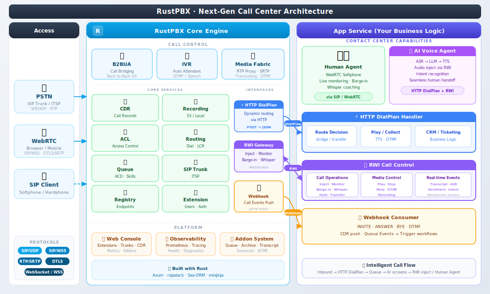
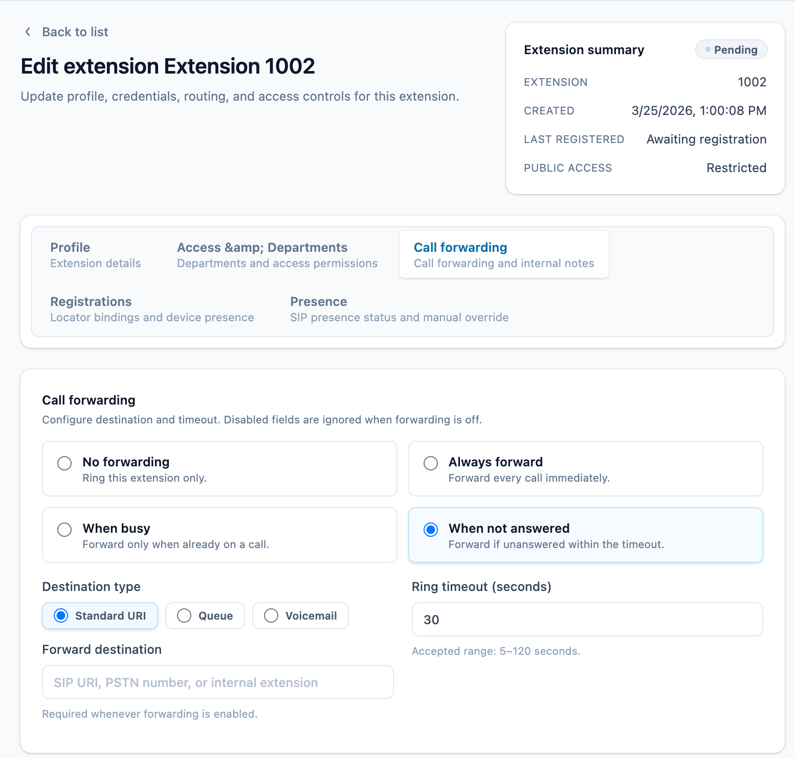
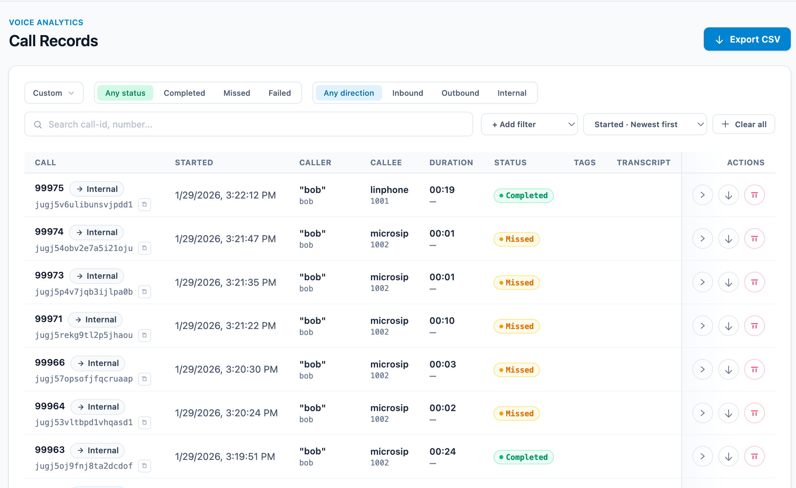
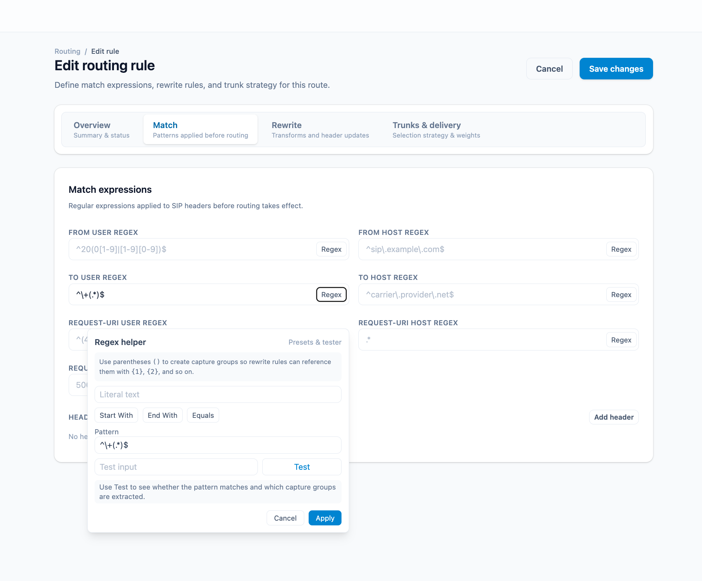
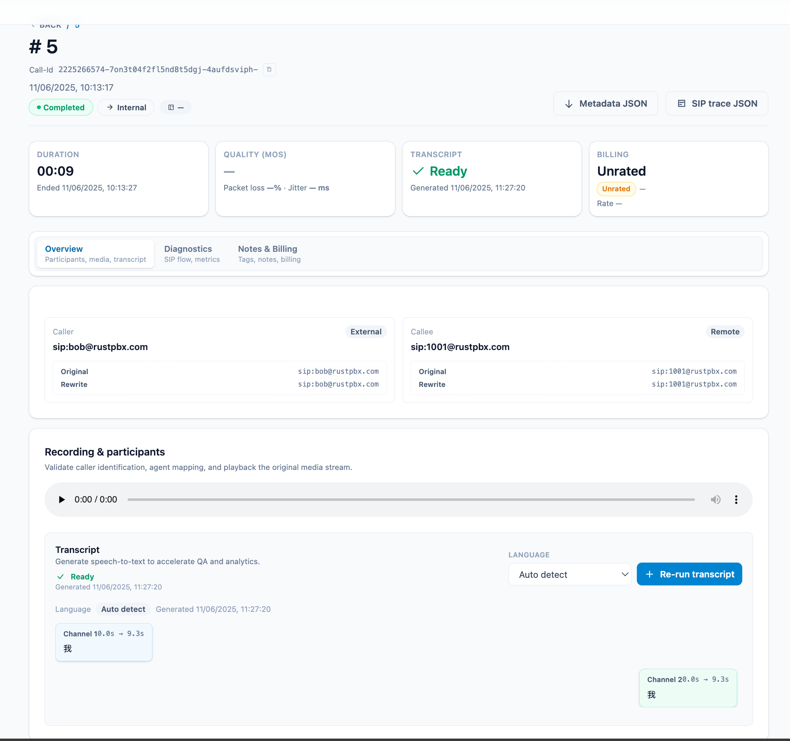
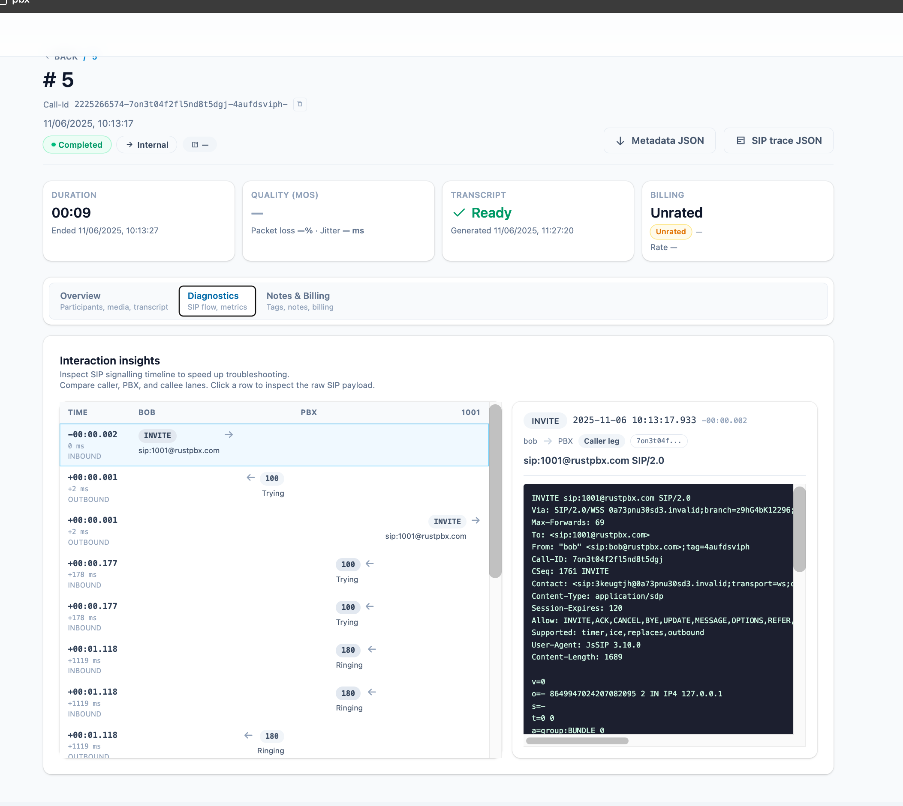
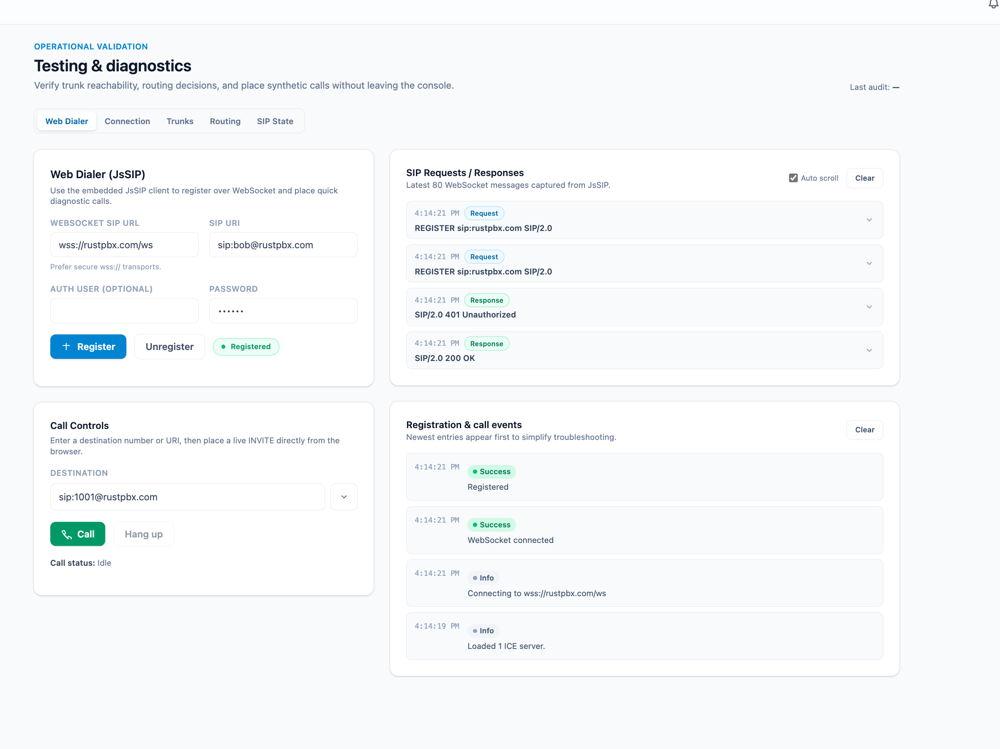

# RustPBX


   


**A high-performance Software-Defined PBX built in Rust** — An AI-native communication platform for next-generation contact centers.

Different from Asterisk/FreeSWITCH (C modules), RustPBX exposes all call control via **HTTP/WebSocket/Webhook**, making it fully programmable in any language. Route decisions, media control, and event streams are all externalized — AI becomes a native participant in every call.

> **Note**: The Voice Agent functionality has been moved to a separate repository: [Active Call](https://github.com/restsend/active-call). This repository now focuses on the SIP Proxy and PBX features.

**[GitHub](https://github.com/restsend/rustpbx)** | **[Website](https://miuda.ai)**

---

## Software-Defined Communication

RustPBX breaks the closed architecture of traditional PBX systems by exposing three powerful integration channels:

| Channel | Protocol | Purpose |
|---------|----------|---------|
| **Policy Decision** | HTTP Router | Real-time routing decisions: AI first, agent queue, IVR, or direct transfer |
| **Real-time Control** | RWI (WebSocket) | In-call control: listen, whisper, barge, transfer, hold, media injection |
| **Event Stream** | Webhook | Push CDR, queue status, and events to your CRM/ticketing system |

---

## Editions

| | Community | Commerce |
|---|---|---|
| License | MIT | Commercial |
| SIP Proxy + Media | ✅ | ✅ |
| HTTP Router (dynamic routing) | ✅ | ✅ |
| Queue / ACD | ✅ | ✅ |
| Call Recording + SipFlow | ✅ | ✅ |
| Transcript (SenseVoice offline) | ✅ | ✅ |
| Web Console | ✅ | ✅ |
| RWI (WebSocket Interface) | ✅ | ✅ |
| **VoIP Wholesale** (VOS3000 alternative) | ❌ | ✅ |
| **IVR Visual Editor** | ❌ | ✅ |
| **Voicemail Pro** | ❌ | ✅ |
| **Enterprise Auth** (LDAP/SAML/MFA) | ❌ | ✅ |
| **Endpoint Manager** (phone auto-provisioning) | ❌ | ✅ |

---

## AI-Native UCaaS Architecture



**Architecture Layers:**
- **App Service Layer**: AI Voice Agent, Human Agents, HTTP DialPlan Handler, RWI Call Control, Webhook Consumer, CRM/Ticketing
- **RustPBX Core Layer**: B2BUA, IVR, Media Fabric, Queue/ACD, Recording, CDR, SIP Trunk
- **Access Layer**: PSTN (SIP Trunk), WebRTC Browser, SIP Client, Mobile App

---

## Core Capabilities

### SIP & Media
- **SIP Proxy** — Full SIP stack (UDP/TCP/WS/TLS/WebRTC), registration, auth, B2BUA
- **Media Proxy** — RTP relay, NAT traversal, WebRTC ↔ SIP bridging
- **TLS/SRTP** — End-to-end encryption with automatic ACME certificate management

### Routing & Control
- **HTTP Router** — Every INVITE hits your webhook; you return routing decision in JSON
- **RWI (WebSocket Interface)** — Real-time call control: originate, answer, hold, transfer, record, queue management, supervisor whisper/barge, and media stream injection (PCM)
- **Queue / ACD** — Sequential or parallel agent ringing, hold music, priority scheduling

### Recording & Analytics
- **SipFlow Recording** — Unified SIP+RTP capture; hourly files with on-demand playback (no file-handle exhaustion)
- **Transcript** — Post-call transcription via local SenseVoice (offline, no cloud dependency)
- **CDR Webhooks** — Push call detail records + recordings to your system on hangup

### Operations
- **Web Console** — Built-in management UI with visual configuration
- **WebRTC Phone** — Built-in browser softphone for testing
- **RBAC** — Role-Based Access Control with fine-grained permissions
- **Observability** — Built-in Prometheus metrics + OpenTelemetry tracing

---

## Typical Use Cases

| Scenario | Description |
|----------|-------------|
| **AI Contact Center** | AI Voice Agent handles incoming calls, transfers to human agents for complex issues, 24/7 availability |
| **Cloud Call Center** | Multi-tenant SaaS architecture, remote agents, WebRTC + SIP endpoints |
| **Enterprise UC** | Internal communication, conferencing, voicemail, CRM/OA integration |
| **VoIP Wholesale** | Multi-carrier routing, flexible billing, profit optimization (Commercial) |
| **Compliance Recording** | Financial/healthcare compliance recording, AI quality inspection, PCI masking |
| **Outbound Marketing** | Predictive dialing, call analytics, lead scoring |

---

## Quick Start (Docker)

```bash
# Commerce image (includes Wholesale + all commercial plugins)
docker pull docker.cnb.cool/miuda.ai/rustpbx:latest

# Community image
docker pull ghcr.io/restsend/rustpbx:latest
```

**Minimal `config.toml`**:
```toml
http_addr = "0.0.0.0:8080"
database_url = "sqlite://rustpbx.sqlite3"

[console]
base_path = "/console"
allow_registration = false

[proxy]
addr = "0.0.0.0"
udp_port = 5060
modules = ["auth", "registrar", "call"]

[[proxy.user_backends]]
type = "memory"
users = [{ username = "1001", password = "password" }]

[sipflow]
type = "local"
root = "./config/cdr"
subdirs = "hourly"
```

```bash
docker run -d --name rustpbx --net host \
  -v $(pwd)/config.toml:/app/config.toml \
  -v $(pwd)/config:/app/config \
  ghcr.io/restsend/rustpbx:latest --conf /app/config.toml

# Create first admin
docker exec rustpbx /app/rustpbx --conf /app/config.toml \
  --super-username admin --super-password changeme
```

Web console: `http://localhost:8080/console/`
SIP proxy: `udp://localhost:5060`

---

## Build from Source

**Dependencies** (Linux):
```bash
apt-get install -y cmake pkg-config libasound2-dev libssl-dev libopus-dev
```

macOS:
```bash
brew install cmake openssl pkg-config
```

```bash
git clone https://github.com/restsend/rustpbx
cd rustpbx
cargo build --release
cargo run --bin rustpbx -- --conf config.toml.example
```

Cross-compilation for `aarch64` / `x86_64` via [cross](https://github.com/cross-rs/cross):
```bash
cargo install cross
cross build --release --target aarch64-unknown-linux-gnu
```

---

## HTTP Router — The Key Extension Point

RustPBX calls your API on every incoming INVITE. You decide what happens:

```toml
[proxy.http_router]
url = "https://your-api.com/route"
timeout_ms = 3000
```

```json
// POST to your endpoint:
{ "call_id": "abc-123", "from": "sip:+861390000@trunk", "to": "sip:400800", "direction": "inbound" }

// Your response:
{ "action": "forward", "targets": ["sip:ai-agent@internal"], "record": true }
```

Actions: `forward` · `reject` · `abort` · `spam`
See [API Integration Guide](docs/api_integration_guide.md) for the full webhook and active call control reference.

---

## RWI — Real-time WebSocket Interface

RWI provides JSON-over-WebSocket for real-time call control:

| Category | Commands |
|----------|----------|
| Call Control | `originate`, `answer`, `hangup`, `bridge`, `transfer`, `hold`, `reject` |
| Media Control | `play`, `stop`, `stream_start`, `inject_start` (PCM) |
| Recording | `record.start`, `pause`, `resume`, `stop`, `mask_segment` |
| Queue Management | `enqueue`, `dequeue`, `set_priority`, `assign_agent`, `requeue` |
| Supervisor | `listen`, `whisper`, `barge`, `takeover` |
| Conference | `create`, `add`, `remove`, `mute`, `destroy` |

See [RWI Protocol](docs/rwi.md) for details.

---

## Screenshots

| Extensions | Call Records | Route Editor |
|---|---|---|
|  |  |  |

| Transcript | SIP Flow | WebRTC Phone |
|---|---|---|
|  |  |  |

---

## Documentation

| | |
|---|---|
| [Configuration Guide](docs/configuration.md) | All config options |
| [API Integration Guide](docs/api_integration_guide.md) | HTTP Router, Webhooks, Active Call Control |
| [RWI Protocol](docs/rwi.md) | WebSocket Interface for real-time call control |

---

## Troubleshooting

**SIP 401 behind NAT/Docker** — set the realm explicitly:
```toml
[proxy]
realms = ["your-public-ip:5060"]
```

---

## Tech Stack


Built with: Rust · Tokio · Axum · SeaORM · SQLite/PostgreSQL/MySQL · Prometheus · OpenTelemetry · WebRTC · SIP (RFC 3261)

---

## License

Community edition: MIT
Commercial edition : [hi@miuda.ai](mailto:hi@miuda.ai)

---

**https://miuda.ai** - Maintenance & commercial support
