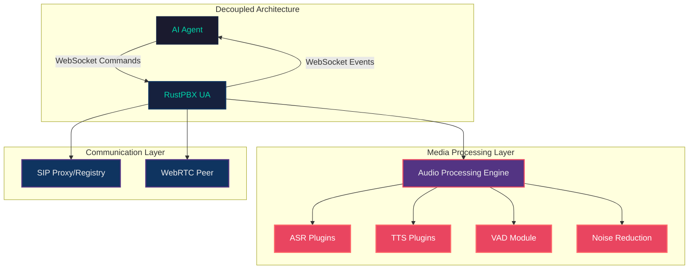
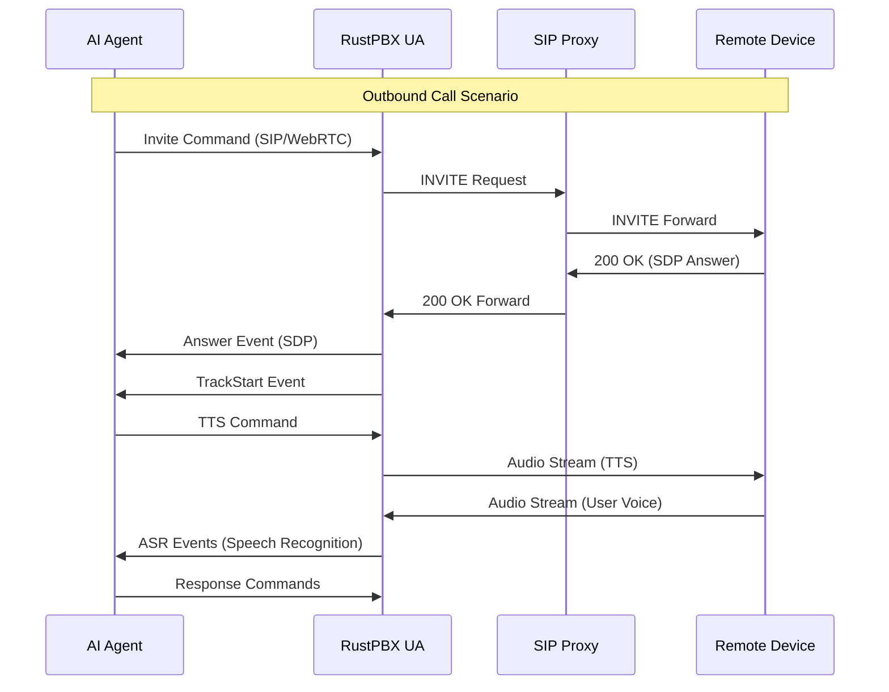
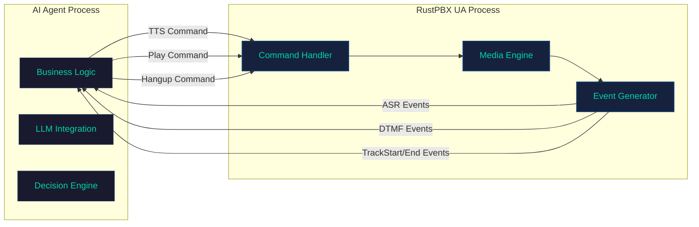
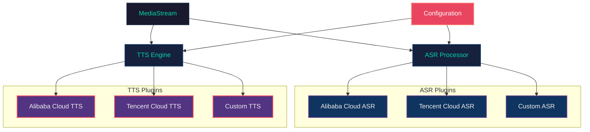
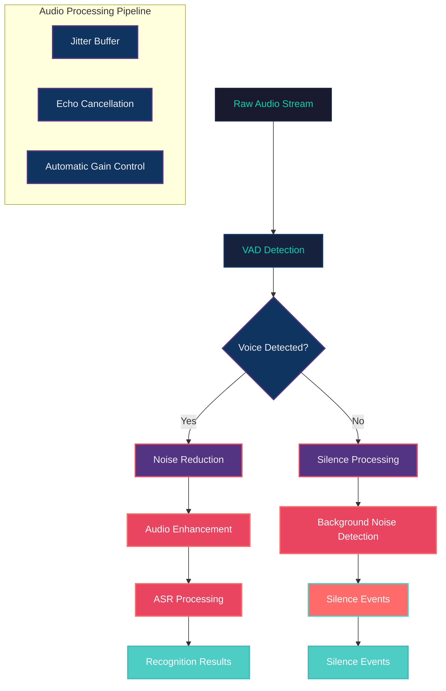
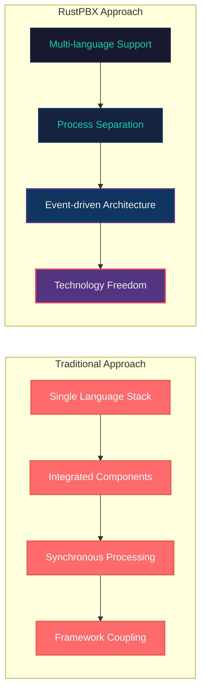
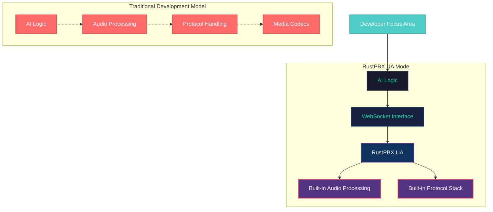
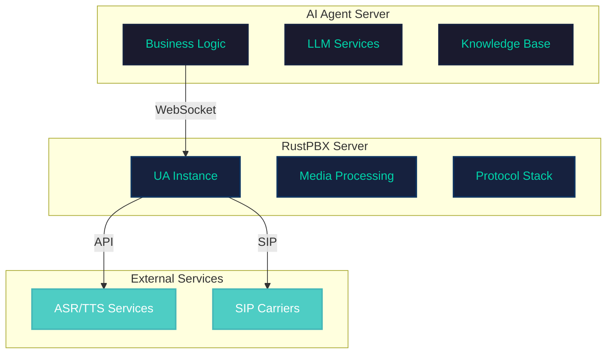

# RustPBX: A Decoupled Architecture for AI Voice Agent Development

## System Architecture Overview

### Core Concepts of UA Mode

RustPBX's UserAgent (UA) mode introduces a decoupled architecture for AI voice agents, separating media processing from business logic through a WebSocket-based command/event interaction pattern.

This architectural approach allows developers to focus on AI logic implementation without requiring deep knowledge of audio processing complexities.



### Key Architectural Features

1. **Separation of Concerns**: Complete isolation between AI logic and audio processing
2. **Flexible Extension**: Support for multiple ASR/TTS service providers
3. **Standard Protocols**: Built on SIP/WebRTC standards
4. **Real-time Interaction**: Low-latency bidirectional WebSocket communication


<div style="page-break-after: always;"></div>

## UA Mode Workflow

### Call Establishment and Media Negotiation

UA mode supports two operational patterns: registering with a SIP proxy server to receive calls, or initiating outbound calls. Media channels can utilize either SIP/RTP or WebRTC, providing significant flexibility.



### Key Component Interactions

The UA manages the complete call lifecycle, including media streams, event processing, and command dispatch.


<div style="page-break-after: always;"></div>

## Command/Event Interaction Mechanism

### WebSocket Protocol for Decoupled Architecture

RustPBX implements a decoupled architecture where AI Agents send commands via WebSocket to control UA behavior, while UA provides status feedback through events.



### Core Command Types

```rust
enum Command {
    Tts { text, speaker, auto_hangup, streaming, ... },
    Play { url, auto_hangup, wait_input_timeout },
    Hangup { reason, initiator },
    Refer { caller, callee, options },
    Mute/Unmute { track_id },
    Pause/Resume,
    Interrupt,
}
```

### Primary Event Types

- **ASR Events**: Real-time speech recognition results
- **DTMF Events**: Touch-tone detection
- **Track Events**: Media track lifecycle changes
- **Silence Events**: Voice activity detection


<div style="page-break-after: always;"></div>

## Plugin-based ASR/TTS Architecture

### Multi-Provider Support

RustPBX employs a plugin architecture supporting various ASR/TTS service providers, including cloud services like Alibaba Cloud and Tencent Cloud, enabling developers to choose the most suitable provider or implement custom solutions.



### Extension Benefits

- **Unified Interface**: All ASR/TTS plugins implement consistent traits
- **Hot-swappable**: Runtime provider switching capability
- **Configuration-driven**: Easy switching through configuration files
- **Error Handling**: Built-in retry and fallback mechanisms


<div style="page-break-after: always;"></div>

## Built-in Audio Processing Features

### Advanced Audio Processing Capabilities

RustPBX includes comprehensive audio processing features such as VAD (Voice Activity Detection), noise reduction, and background noise enhancement, significantly improving voice interaction quality.



### Advanced TTS/Play Features

RustPBX implements various practical features for TTS and audio playback:

```rust
TtsCommand {
    streaming: Some(true),         // Enable streaming output
    end_of_stream: Some(false),    // Mark stream end
    auto_hangup: Some(true),       // Auto-hangup after playback
    wait_input_timeout: Some(30),  // Input timeout in seconds
}
```

### Feature Highlights

1. **Streaming TTS**: Real-time generation and playback for reduced latency
2. **Auto-hangup**: Automatic call termination after playback completion
3. **Input Waiting**: Post-playback waiting for voice or DTMF input
4. **Interruption Support**: User-initiated playback interruption
5. **Background Music**: Hold music during wait periods


<div style="page-break-after: always;"></div>

## Architectural Comparison: RustPBX UA Mode vs Alternative Approaches

### Design Philosophy Differences

RustPBX UA mode represents a decoupled architectural approach for AI voice agents. While some frameworks utilize monolithic architectures with all components in a single process, RustPBX separates AI logic from media processing entirely.

```mermaid
graph TB
    subgraph "Monolithic Architecture"
        P1[AI Logic]
        P2[Audio Processing]
        P3[Protocol Stack]
        P4[Media Codecs]
        P5[ASR/TTS]
        
        P1 --> P2
        P2 --> P3
        P3 --> P4
        P4 --> P5
    end
    
    subgraph "RustPBX Decoupled Architecture"
        R1[AI Agent Process]
        R2[WebSocket Interface]
        R3[RustPBX UA Process]
        R4[Built-in Audio Processing]
        R5[Built-in Protocol Stack]
        
        R1 --> R2
        R2 --> R3
        R3 --> R4
        R3 --> R5
    end
    
    style P1 fill:#ff6b6b,stroke:#ee5a52,stroke-width:2px,color:#fff
    style P2 fill:#ff6b6b,stroke:#ee5a52,stroke-width:2px,color:#fff
    style P3 fill:#ff6b6b,stroke:#ee5a52,stroke-width:2px,color:#fff
    style P4 fill:#ff6b6b,stroke:#ee5a52,stroke-width:2px,color:#fff
    style P5 fill:#ff6b6b,stroke:#ee5a52,stroke-width:2px,color:#fff
    style R1 fill:#1a1a2e,stroke:#16213e,stroke-width:2px,color:#00d4aa
    style R2 fill:#16213e,stroke:#0f3460,stroke-width:2px,color:#00d4aa
    style R3 fill:#0f3460,stroke:#533483,stroke-width:2px,color:#eee
    style R4 fill:#533483,stroke:#e94560,stroke-width:2px,color:#eee
    style R5 fill:#533483,stroke:#e94560,stroke-width:2px,color:#eee
```



### Development Approach Comparison



### Key Architectural Differences

| Aspect                 | Monolithic Approach                    | RustPBX UA Mode                       |
| ---------------------- | -------------------------------------- | ------------------------------------- |
| **Architecture**       | Integrated components                  | Decoupled AI and media                |
| **Language Support**   | Framework-specific                     | Any language (Python/JS/Go/Java/etc.) |
| **Deployment**         | Single process                         | Distributed, independently scalable   |
| **Learning Curve**     | Requires audio processing knowledge    | Focus on AI logic only                |
| **Debugging**          | Coupled AI and media issues            | Isolated problem domains              |
| **Extensibility**      | Framework-bound extensions             | Plugin-based, hot-swappable           |
| **Technical Debt**     | Framework upgrades affect entire stack | Independent AI and media evolution    |
| **Team Collaboration** | Requires full-stack developers         | Enables specialized team roles        |

### Use Case Considerations

**Monolithic architectures may suit:**
- Rapid prototyping and validation
- Small-scale or personal projects
- Strong framework ecosystem dependencies
- Simple voice interaction requirements

**RustPBX UA mode excels for:**
- Enterprise applications and production environments
- High-scalability system requirements
- Multi-team collaborative development
- Complex voice interaction scenarios
- Performance and stability-critical applications

### Performance and Maintainability

```mermaid
graph TB
    subgraph "Performance Characteristics"
        PA[Traditional Performance]
        PB[Single Process Limits]
        PC[Runtime Constraints]
        
        RA[RustPBX Performance]
        RB[Multi-process Parallelism]
        RC[High-performance Runtime]
        
        PA --> PB
        PB --> PC
        RA --> RB
        RB --> RC
    end
    
    subgraph "Maintainability Aspects"
        PM[Traditional Maintenance]
        PN[High Coupling]
        PO[Complex Debugging]
        
        RM[RustPBX Maintenance]
        RN[Modular Decoupling]
        RO[Problem Isolation]
        
        PM --> PN
        PN --> PO
        RM --> RN
        RN --> RO
    end
    
    style PA fill:#ff6b6b,stroke:#ee5a52,stroke-width:2px,color:#fff
    style PB fill:#ff6b6b,stroke:#ee5a52,stroke-width:2px,color:#fff
    style PC fill:#ee5a52,stroke:#c44569,stroke-width:2px,color:#fff
    style PM fill:#ff6b6b,stroke:#ee5a52,stroke-width:2px,color:#fff
    style PN fill:#ff6b6b,stroke:#ee5a52,stroke-width:2px,color:#fff
    style PO fill:#ee5a52,stroke:#c44569,stroke-width:2px,color:#fff
    style RA fill:#1a1a2e,stroke:#16213e,stroke-width:2px,color:#00d4aa
    style RB fill:#16213e,stroke:#0f3460,stroke-width:2px,color:#00d4aa
    style RC fill:#4ecdc4,stroke:#45b7b8,stroke-width:2px,color:#fff
    style RM fill:#1a1a2e,stroke:#16213e,stroke-width:2px,color:#00d4aa
    style RN fill:#16213e,stroke:#0f3460,stroke-width:2px,color:#00d4aa
    style RO fill:#4ecdc4,stroke:#45b7b8,stroke-width:2px,color:#fff
```




<div style="page-break-after: always;"></div>

## Voice Agent Development Benefits

### Development Productivity Analysis

RustPBX's UA mode provides significant productivity benefits for Voice Agent development, enabling developers to concentrate on AI logic without handling complex audio and communication protocols.



### Technology Stack Freedom

Developers can utilize any programming language and AI framework:

- **Python**: LangChain, OpenAI SDK, FastAPI
- **JavaScript**: Node.js, OpenAI API, Express
- **Java**: Spring Boot, AI frameworks
- **Go**: Custom AI logic, high-performance services
- **Rust**: Local AI inference, system-level optimization

### Deployment Architecture Flexibility



### Development Advantages Summary

1. **Reduced Learning Curve**: No audio processing or SIP protocol expertise required
2. **Accelerated Development**: Focus on business logic enables rapid iteration
3. **Enhanced Testability**: WebSocket interface facilitates unit testing
4. **Horizontal Scalability**: Distributed deployment with support for WebRTC/SIP/WebSocket
5. **Technology Agnostic**: No constraints on AI development technology choices
6. **Production Ready**: Built-in monitoring, logging, and error handling


<div style="page-break-after: always;"></div>

## Conclusion

RustPBX's UA mode delivers a robust and flexible platform for AI Voice Agent development through its decoupled architecture, WebSocket interaction mechanism, plugin-based design, and comprehensive audio processing capabilities. This approach enables developers to focus on AI logic implementation while delegating complex audio processing and communication protocols to RustPBX, significantly reducing development barriers and enhancing productivity.

The architecture's emphasis on separation of concerns, technology freedom, and operational flexibility makes it particularly well-suited for enterprise applications and production environments where scalability, maintainability, and team collaboration are paramount considerations.
