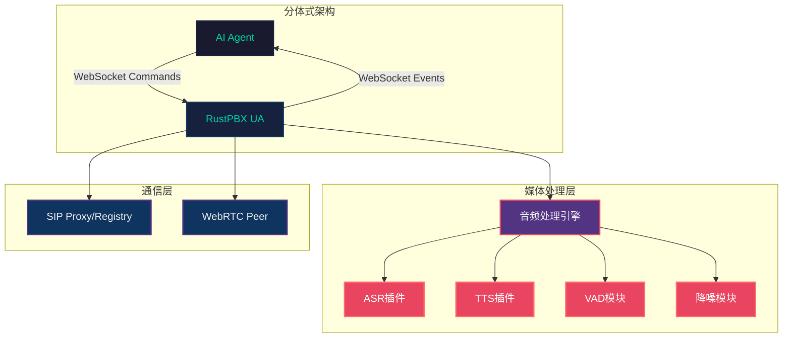
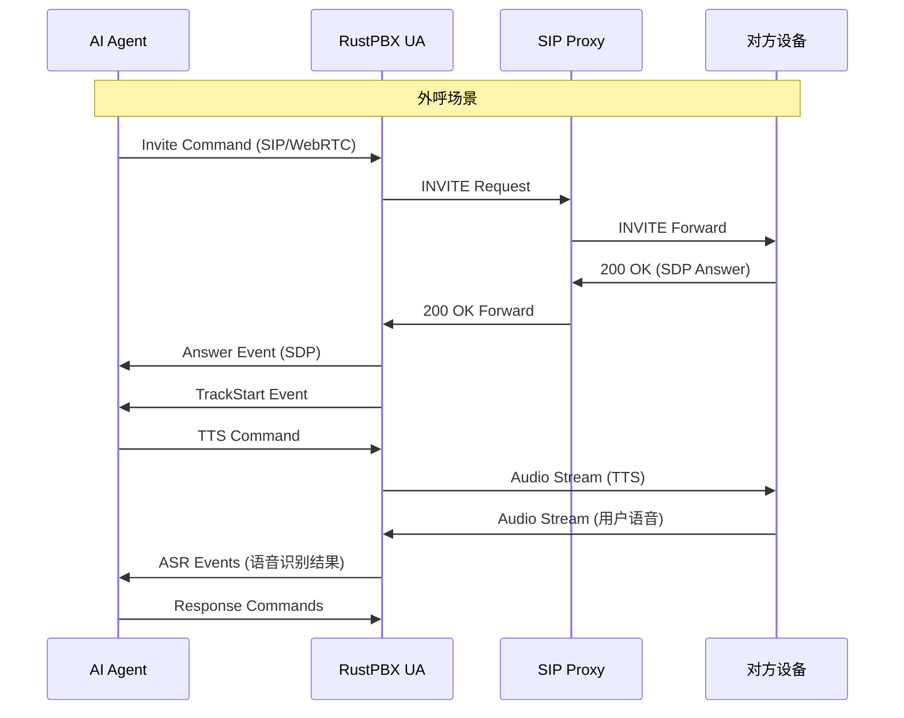
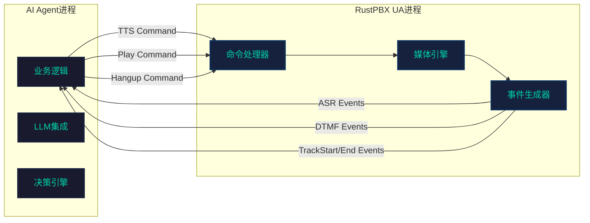
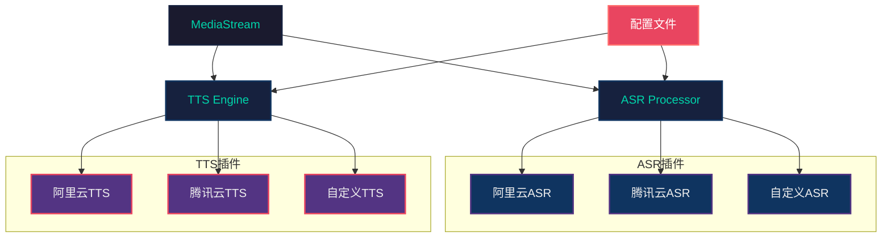
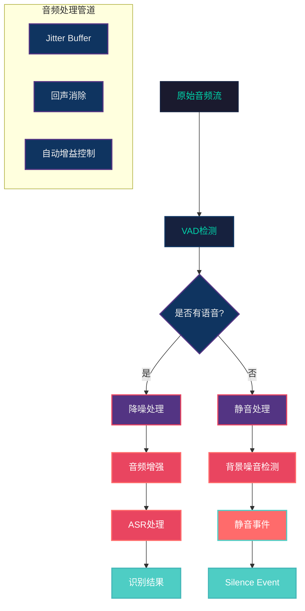
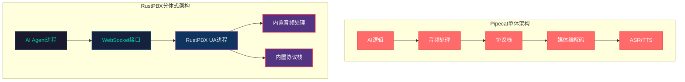
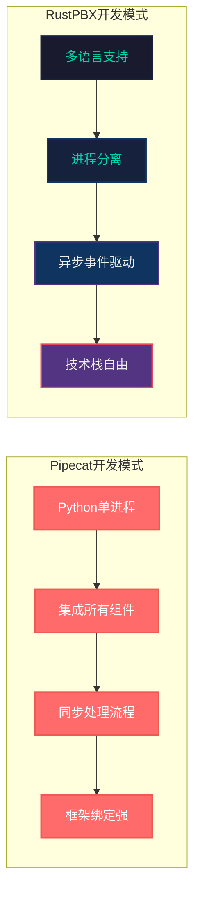
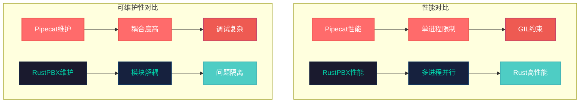
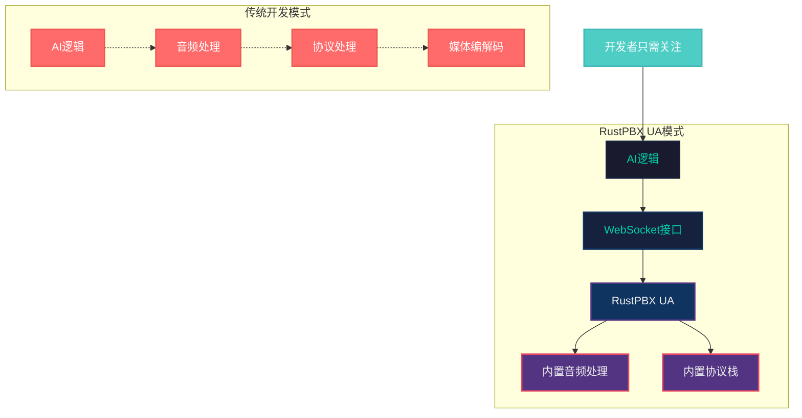
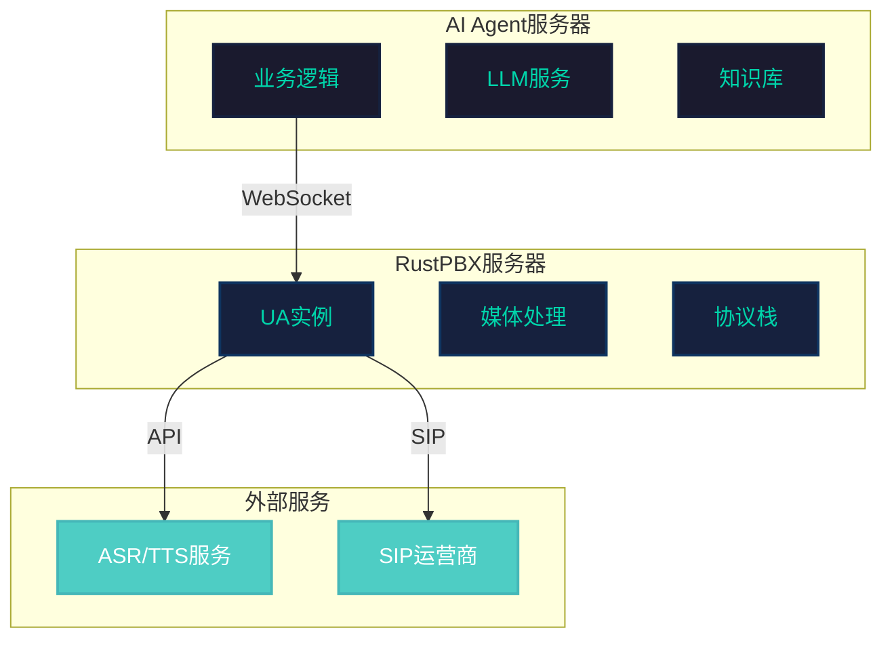

# RustPBX: 分体式VoiceAgent架构

## 系统架构概览

### UA模式核心概念

RustPBX的UserAgent（UA）模式是一种创新的AI语音代理架构，它将媒体处理与业务逻辑完全分离，通过WebSocket协议实现command/event交互模式。

分体式架构使得开发者可以专注于AI逻辑开发，而无需深入了解音频处理的复杂细节。



### 架构特点

1. **分离关注点**：AI逻辑与音频处理完全分离
2. **灵活扩展**：支持多种ASR/TTS服务商
3. **标准协议**：基于SIP/WebRTC标准
4. **实时交互**：WebSocket双向通信保证低延迟

<div style="page-break-after: always;"></div>

## UA模式工作流程

### 呼叫建立与媒体协商

UA模式支持两种工作方式：注册到SIP代理服务器接收呼叫，或者主动发起呼叫。媒体通道可以是SIP/RTP或者WebRTC，提供了极大的灵活性。



### 关键组件交互

UA管理着整个呼叫的生命周期，包括媒体流、事件处理和命令分发。

<div style="page-break-after: always;"></div>

## Command/Event交互机制

### WebSocket协议实现分体式架构

与Pipecat等单体架构不同，RustPBX采用分体式架构，AI Agent通过WebSocket发送命令控制UA行为，UA通过事件反馈状态和结果。



### 主要Commands类型

```rust
// 从代码中提取的核心命令类型
enum Command {
    Tts { text, speaker, auto_hangup, streaming, ... },
    Play { url, auto_hangup, wait_input_timeout },
    Hangup { reason, initiator },
    Refer { caller, callee, options },
    Mute/Unmute { track_id },
    Pause/Resume,
    Interrupt,
}
```

### 主要Events类型

- **ASR Events**: 实时语音识别结果
- **DTMF Events**: 按键检测
- **Track Events**: 媒体轨道状态变化
- **Silence Events**: 静音检测

<div style="page-break-after: always;"></div>

## 插件化ASR/TTS架构

### 多服务商支持

RustPBX通过插件化架构支持多种ASR/TTS服务商，包括阿里云、腾讯云等，开发者可以根据需求选择最适合的服务商或者自定义实现。



### 扩展便利性

- **统一接口**：所有ASR/TTS插件实现相同的trait
- **热插拔**：支持运行时切换服务商
- **配置驱动**：通过配置文件轻松切换
- **错误处理**：内置重试和降级机制

<div style="page-break-after: always;"></div>

## 内置音频处理特性

### 高级音频处理能力

RustPBX内置了多种音频处理特性，包括VAD（语音活动检测）、降噪、背景噪音增强等，这些特性大大提升了语音交互的质量。



### TTS/Play高级特性

RustPBX在TTS和播放功能上实现了多种实用特性：

```rust
// 流式TTS支持
TtsCommand {
    streaming: Some(true),     // 启用流式输出
    end_of_stream: Some(false), // 标记流结束
    auto_hangup: Some(true),   // 播放完自动挂机
    wait_input_timeout: Some(30), // 等待输入超时
}
```

### 特性详解

1. **流式TTS**：支持边生成边播放，降低延迟
2. **自动挂机**：播放完成后自动结束通话
3. **等待输入**：播放后等待用户语音或DTMF输入
4. **打断支持**：用户可以随时打断播放
5. **背景音乐**：支持在等待期间播放背景音乐

<div style="page-break-after: always;"></div>

## RustPBX UA模式 vs Pipecat框架对比

### 架构模式差异

RustPBX UA模式与Pipecat框架代表了两种不同的AI语音代理架构理念。Pipecat采用单体架构，所有组件运行在同一进程中；而RustPBX UA模式采用分体式架构，AI逻辑与媒体处理完全分离。



### 开发模式对比



### 关键差异对比

| 维度         | Pipecat                | RustPBX UA模式                      |
| ------------ | ---------------------- | ----------------------------------- |
| **架构模式** | 单体架构，所有组件集成 | 分体式架构，AI与媒体分离            |
| **开发语言** | 仅支持Python           | 支持任意语言（Python/JS/Go/Java等） |
| **部署方式** | 单进程部署             | 分布式部署，可独立扩展              |
| **学习成本** | 需要了解音频处理细节   | 只需关注AI逻辑                      |
| **调试难度** | AI和媒体问题耦合       | 问题域隔离，易于定位                |
| **扩展性**   | 框架内扩展             | 插件化扩展，热插拔                  |
| **技术债务** | 框架升级影响全栈       | AI与媒体独立迭代                    |
| **团队协作** | 需要全栈开发者         | 可分工协作开发                      |

### 适用场景分析

**Pipecat适合：**
- 快速原型验证
- 小型项目或个人项目
- 对Python生态依赖较强的场景
- 简单的语音交互需求

**RustPBX UA模式适合：**
- 企业级应用和生产环境
- 需要高可扩展性的系统
- 多团队协作开发
- 复杂的语音交互场景
- 对性能和稳定性要求较高的场景

### 性能与可维护性



<div style="page-break-after: always;"></div>

## Voice Agent开发优势

### 开发便利性分析

RustPBX的UA模式为Voice Agent开发提供了极大的便利性，开发者可以专注于AI逻辑而不需要处理复杂的音频和通信协议。



### 技术栈选择自由

开发者可以使用任何编程语言和AI框架：

- **Python**: LangChain, OpenAI SDK
- **JavaScript**: Node.js, OpenAI API
- **Java**: Spring Boot, AI框架
- **Go**: 自定义AI逻辑
- **Rust**: 本地AI推理

### 部署架构灵活性



### 开发优势总结

1. **低学习成本**：无需了解音频处理和SIP协议
2. **高开发效率**：专注业务逻辑，快速迭代
3. **易于测试**：WebSocket接口便于单元测试
4. **可扩展性**：支持分布式部署，支持WebRTC/Sip/Websocket等三种音频交互方式
5. **技术栈自由**：不限制AI开发技术选择
6. **生产就绪**：内置监控、日志、错误处理

<div style="page-break-after: always;"></div>

## 总结

RustPBX的UA模式通过分体式架构、WebSocket交互机制、插件化设计和内置音频处理特性，为AI Voice Agent的开发提供了一个强大而灵活的平台。开发者可以专注于AI逻辑的实现，而将复杂的音频处理和通信协议交给RustPBX处理，大大降低了开发门槛，提高了开发效率。
