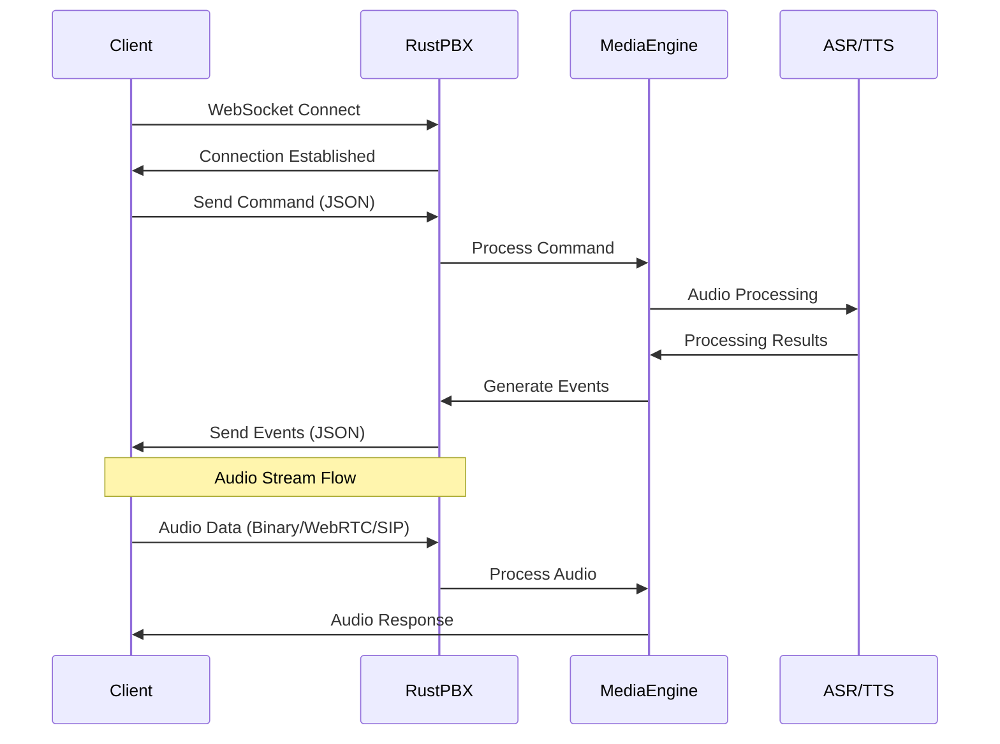
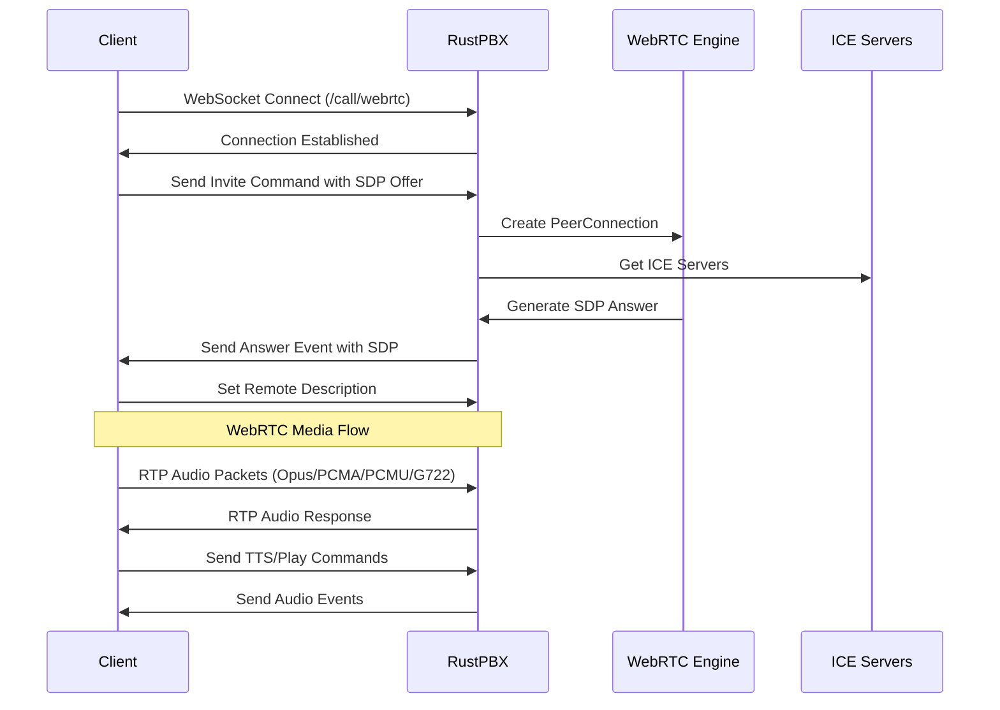
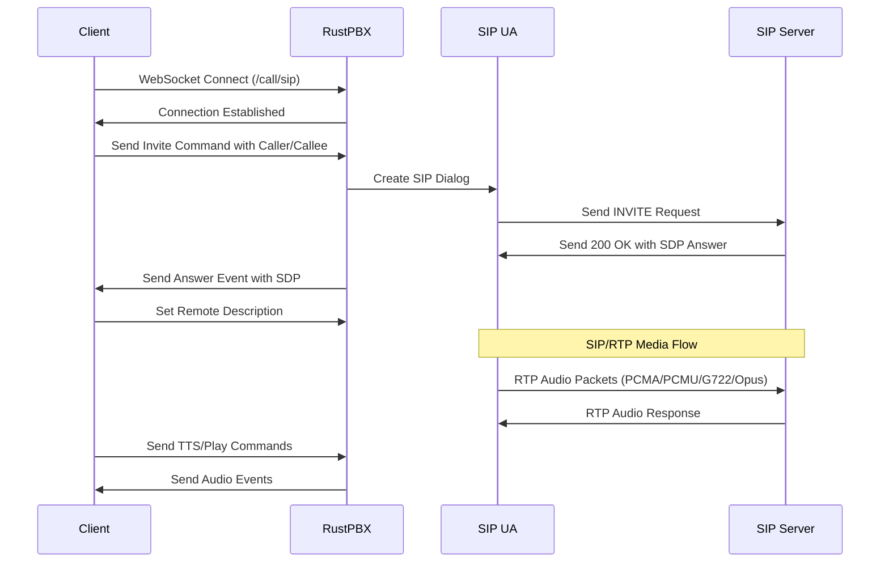

# RustPBX API Documentation

This document describes the REST API endpoints provided by RustPBX.

## Base URL

All API endpoints are relative to the server base URL.

## Authentication

Most endpoints require WebSocket upgrade for real-time communication.

## WebSocket Call Endpoints

The following three endpoints establish WebSocket connections for different voice communication protocols:

### 1. WebSocket Call Handler

**Endpoint:** `GET /call`

**Description:** Establishes a WebSocket connection for voice call handling with audio stream transmitted via WebSocket.

**Parameters:**
- `id` (optional, string): Session ID. If not provided, a new UUID will be generated.
- `dump` (optional, boolean): Enable event dumping. Default: `true`.

**Response:** WebSocket connection upgrade

**Usage:**
```javascript
const ws = new WebSocket('ws://localhost:8080/call?id=session123&dump=true');
```

### 2. WebRTC Call Handler

**Endpoint:** `GET /call/webrtc`

**Description:** Establishes a WebSocket connection for WebRTC call handling with audio stream transmitted via WebRTC RTP.

**Parameters:**
- `id` (optional, string): Session ID. If not provided, a new UUID will be generated.
- `dump` (optional, boolean): Enable event dumping. Default: `true`.

**Response:** WebSocket connection upgrade

**Usage:**
```javascript
const ws = new WebSocket('ws://localhost:8080/call/webrtc?id=session123&dump=true');
```

### 3. SIP Call Handler

**Endpoint:** `GET /call/sip`

**Description:** Establishes a WebSocket connection for SIP call handling with audio stream transmitted via SIP/RTP.

**Parameters:**
- `id` (optional, string): Session ID. If not provided, a new UUID will be generated.
- `dump` (optional, boolean): Enable event dumping. Default: `true`.

**Response:** WebSocket connection upgrade

**Usage:**
```javascript
const ws = new WebSocket('ws://localhost:8080/call/sip?id=session123&dump=true');
```

## WebSocket Communication Flow



## WebRTC Call Flow



## SIP Call Flow



## Voice Stream Communication Methods

### 1. WebSocket Audio Stream (`/call`)
- **Audio Format:** PCM, PCMA, PCMU, G722
- **Transport:** WebSocket binary messages
- **Usage:** Direct audio streaming over WebSocket connection
- **Advantages:** Simple, low latency, works through firewalls

### 2. WebRTC Audio Stream (`/call/webrtc`)
- **Audio Format:** Opus, PCMA, PCMU, G722
- **Transport:** WebRTC RTP over UDP
- **Usage:** Browser-compatible, NAT traversal
- **Advantages:** Browser native support, adaptive bitrate

### 3. SIP Audio Stream (`/call/sip`)
- **Audio Format:** PCMA, PCMU, G722, Opus
- **Transport:** SIP/RTP over UDP
- **Usage:** Traditional telephony integration
- **Advantages:** Standard telephony protocol, PBX integration

## WebSocket Commands

Commands are sent as JSON messages through the WebSocket connection. All timestamps are in milliseconds.

### Invite Command
**Purpose:** Initiates a new call or accepts an incoming call.

**Fields:**
- `command` (string): Always "invite" or "accept"
- `option` (object): Call configuration options
  - `caller` (string, optional): Caller phone number
  - `callee` (string, optional): Callee phone number  
  - `offer` (string, optional): SDP offer for WebRTC calls
  - `codec` (string, optional): Audio codec (pcmu, pcma, g722, pcm)
  - `asr` (object, optional): ASR configuration
  - `tts` (object, optional): TTS configuration

```json
{
  "command": "invite",
  "option": {
    "caller": "1234567890",
    "callee": "0987654321",
    "offer": "v=0\r\no=- 1234567890 2 IN IP4 127.0.0.1\r\n...",
    "codec": "g722",
    "asr": {
      "provider": "tencent"
    },
    "tts": {
      "provider": "tencent"
    }
  }
}
```

### Accept Command
**Purpose:** Accepts an incoming call.

```json
{
  "command": "accept",
  "option": {
    "caller": "1234567890",
    "callee": "0987654321",
    "offer": "v=0\r\no=- 1234567890 2 IN IP4 127.0.0.1\r\n...",
    "codec": "g722"
  }
}
```

### TTS Command
**Purpose:** Converts text to speech and plays audio.

**Fields:**
- `command` (string): Always "tts"
- `text` (string): Text to synthesize
- `speaker` (string, optional): Speaker voice name
- `playId` (string, optional): **Unique identifier for this TTS session. If the same playId is used, it will not interrupt the previous playback.**
- `autoHangup` (boolean, optional): **If true, the call will be automatically hung up after TTS playback is finished.**
- `streaming` (boolean, optional): **If true, indicates streaming text input (like LLM streaming output).**
- `endOfStream` (boolean, optional): **If true, indicates the input text is finished (used with streaming).**
- `option` (object, optional): TTS provider specific options

```json
{
  "command": "tts",
  "text": "Hello, this is a test message",
  "speaker": "speaker_name",
  "playId": "unique_play_id",
  "autoHangup": false,
  "streaming": false,
  "endOfStream": false,
  "option": {
    "provider": "tencent",
    "voice": "xiaoyan"
  }
}
```

### Play Command
**Purpose:** Plays audio from a URL.

**Fields:**
- `command` (string): Always "play"
- `url` (string): URL of audio file to play
- `autoHangup` (boolean, optional): **If true, the call will be automatically hung up after playback is finished.**

```json
{
  "command": "play",
  "url": "http://example.com/audio.mp3",
  "autoHangup": false
}
```

### Hangup Command
**Purpose:** Ends the call.

**Fields:**
- `command` (string): Always "hangup"
- `reason` (string, optional): Reason for hanging up
- `initiator` (string, optional): Who initiated the hangup (user, system, etc.)

```json
{
  "command": "hangup",
  "reason": "user_requested",
  "initiator": "user"
}
```

### Interrupt Command
**Purpose:** Interrupts current TTS or audio playback.

```json
{
  "command": "interrupt"
}
```

### Pause Command
**Purpose:** Pauses current playback (not implemented in current version).

```json
{
  "command": "pause"
}
```

### Resume Command
**Purpose:** Resumes paused playback (not implemented in current version).

```json
{
  "command": "resume"
}
```

### Candidate Command (WebRTC)
**Purpose:** Sends ICE candidates for WebRTC connection.

**Fields:**
- `command` (string): Always "candidate"
- `candidates` (array): Array of ICE candidate strings

```json
{
  "command": "candidate",
  "candidates": [
    "candidate:1 1 UDP 2122252543 192.168.1.1 12345 typ host"
  ]
}
```

## WebSocket Events

Events are received as JSON messages from the server. All timestamps are in milliseconds.

### Incoming Event
**Triggered when:** An incoming call is received (SIP calls only).

**Fields:**
- `event` (string): Always "incoming"
- `trackId` (string): **Unique identifier for the audio track. Used to identify which track generated this event.**
- `timestamp` (number): Event timestamp in milliseconds
- `caller` (string): Caller phone number
- `callee` (string): Callee phone number
- `sdp` (string): SDP offer from the caller

```json
{
  "event": "incoming",
  "trackId": "track-123",
  "timestamp": 1640995200000,
  "caller": "1234567890",
  "callee": "0987654321",
  "sdp": "v=0\r\no=- 1234567890 2 IN IP4 127.0.0.1\r\n..."
}
```

### Answer Event
**Triggered when:** Call is answered and SDP negotiation is complete.

**Fields:**
- `event` (string): Always "answer"
- `trackId` (string): **Unique identifier for the audio track.**
- `timestamp` (number): Event timestamp in milliseconds
- `sdp` (string): SDP answer from the server

```json
{
  "event": "answer",
  "trackId": "track-123",
  "timestamp": 1640995200000,
  "sdp": "v=0\r\no=- 1234567890 2 IN IP4 127.0.0.1\r\n..."
}
```

### Ringing Event
**Triggered when:** Call is ringing (SIP calls only).

**Fields:**
- `event` (string): Always "ringing"
- `trackId` (string): **Unique identifier for the audio track.**
- `timestamp` (number): Event timestamp in milliseconds
- `earlyMedia` (boolean): Whether early media is available

```json
{
  "event": "ringing",
  "trackId": "track-123",
  "timestamp": 1640995200000,
  "earlyMedia": false
}
```

### Hangup Event
**Triggered when:** Call is ended.

**Fields:**
- `event` (string): Always "hangup"
- `timestamp` (number): Event timestamp in milliseconds
- `reason` (string, optional): Reason for hangup
- `initiator` (string, optional): Who initiated the hangup

```json
{
  "event": "hangup",
  "timestamp": 1640995200000,
  "reason": "user_requested",
  "initiator": "user"
}
```

### Speaking Event
**Triggered when:** Voice activity detection detects speech.

**Fields:**
- `event` (string): Always "speaking"
- `trackId` (string): **Unique identifier for the audio track.**
- `timestamp` (number): Event timestamp in milliseconds
- `startTime` (number): When speech started in milliseconds

```json
{
  "event": "speaking",
  "trackId": "track-123",
  "timestamp": 1640995200000,
  "startTime": 1640995200000
}
```

### Silence Event
**Triggered when:** Voice activity detection detects silence.

**Fields:**
- `event` (string): Always "silence"
- `trackId` (string): **Unique identifier for the audio track.**
- `timestamp` (number): Event timestamp in milliseconds
- `startTime` (number): When silence started in milliseconds
- `duration` (number): Duration of silence in milliseconds

```json
{
  "event": "silence",
  "trackId": "track-123",
  "timestamp": 1640995200000,
  "startTime": 1640995200000,
  "duration": 5000
}
```

### ASR Final Event
**Triggered when:** ASR provides final transcription result.

**Fields:**
- `event` (string): Always "asrFinal"
- `trackId` (string): **Unique identifier for the audio track.**
- `timestamp` (number): Event timestamp in milliseconds
- `index` (number): ASR result index
- `startTime` (number, optional): Start time of speech in milliseconds
- `endTime` (number, optional): End time of speech in milliseconds
- `text` (string): Final transcribed text

```json
{
  "event": "asrFinal",
  "trackId": "track-123",
  "timestamp": 1640995200000,
  "index": 1,
  "startTime": 1640995200000,
  "endTime": 1640995210000,
  "text": "Hello, how can I help you?"
}
```

### ASR Delta Event
**Triggered when:** ASR provides partial transcription result.

**Fields:**
- `event` (string): Always "asrDelta"
- `trackId` (string): **Unique identifier for the audio track.**
- `index` (number): ASR result index
- `timestamp` (number): Event timestamp in milliseconds
- `startTime` (number, optional): Start time of speech in milliseconds
- `endTime` (number, optional): End time of speech in milliseconds
- `text` (string): Partial transcribed text

```json
{
  "event": "asrDelta",
  "trackId": "track-123",
  "index": 1,
  "timestamp": 1640995200000,
  "startTime": 1640995200000,
  "endTime": 1640995210000,
  "text": "Hello"
}
```

### DTMF Event
**Triggered when:** DTMF tone is detected.

**Fields:**
- `event` (string): Always "dtmf"
- `trackId` (string): **Unique identifier for the audio track.**
- `timestamp` (number): Event timestamp in milliseconds
- `digit` (string): DTMF digit (0-9, *, #, A-D)

```json
{
  "event": "dtmf",
  "trackId": "track-123",
  "timestamp": 1640995200000,
  "digit": "1"
}
```

### Track Start Event
**Triggered when:** Audio track starts (TTS, file playback, etc.).

**Fields:**
- `event` (string): Always "trackStart"
- `trackId` (string): **Unique identifier for the audio track.**
- `timestamp` (number): Event timestamp in milliseconds

```json
{
  "event": "trackStart",
  "trackId": "track-123",
  "timestamp": 1640995200000
}
```

### Track End Event
**Triggered when:** Audio track ends (TTS finished, file playback finished, etc.).

**Fields:**
- `event` (string): Always "trackEnd"
- `trackId` (string): **Unique identifier for the audio track.**
- `timestamp` (number): Event timestamp in milliseconds
- `duration` (number): Duration of track in milliseconds

```json
{
  "event": "trackEnd",
  "trackId": "track-123",
  "timestamp": 1640995200000,
  "duration": 30000
}
```

### Interruption Event
**Triggered when:** Current playback is interrupted.

**Fields:**
- `event` (string): Always "interruption"
- `trackId` (string): **Unique identifier for the audio track.**
- `timestamp` (number): Event timestamp in milliseconds
- `position` (number): Current playback position in milliseconds when interrupted

```json
{
  "event": "interruption",
  "trackId": "track-123",
  "timestamp": 1640995200000,
  "position": 15000
}
```

### Error Event
**Triggered when:** An error occurs during processing.

**Fields:**
- `event` (string): Always "error"
- `trackId` (string): **Unique identifier for the audio track.**
- `timestamp` (number): Event timestamp in milliseconds
- `sender` (string): Component that generated the error (asr, tts, etc.)
- `error` (string): Error message
- `code` (number, optional): Error code

```json
{
  "event": "error",
  "trackId": "track-123",
  "timestamp": 1640995200000,
  "sender": "asr",
  "error": "Connection timeout",
  "code": 408
}
```

### Metrics Event
**Triggered when:** Performance metrics are available.

**Fields:**
- `event` (string): Always "metrics"
- `timestamp` (number): Event timestamp in milliseconds
- `key` (string): Metric key (e.g., "ttfb.asr.tencent", "completed.asr.tencent")
- `duration` (number): Duration in milliseconds
- `data` (object): Additional metric data

```json
{
  "event": "metrics",
  "timestamp": 1640995200000,
  "key": "ttfb.asr.tencent",
  "duration": 150,
  "data": {
    "index": 1
  }
}
```

### Binary Event (Audio Data)
**Triggered when:** Binary audio data is sent (WebSocket calls only).

**Fields:**
- `event` (string): Always "binary"
- `trackId` (string): **Unique identifier for the audio track.**
- `timestamp` (number): Event timestamp in milliseconds
- `data` (array): Binary audio data

```json
{
  "event": "binary",
  "trackId": "track-123",
  "timestamp": 1640995200000,
  "data": [/* binary audio data */]
}
```

## REST API Endpoints

### 4. List Active Calls

**Endpoint:** `GET /call/lists`

**Description:** Returns a list of all currently active calls.

**Parameters:** None

**Response:**
```json
{
  "calls": [
    {
      "id": "session-id",
      "call_type": "webrtc",
      "created_at": "2024-01-01T12:00:00Z",
      "option": {
        "caller": "1234567890",
        "callee": "0987654321",
        "offer": "sdp-offer-string"
      }
    }
  ]
}
```

**Usage:**
```bash
curl http://localhost:8080/call/lists
```

### 5. Kill Call

**Endpoint:** `POST /call/kill/{id}`

**Description:** Terminates a specific active call by its session ID.

**Parameters:**
- `id` (path parameter, string): The session ID of the call to terminate.

**Response:**
```json
true
```

**Usage:**
```bash
curl -X POST http://localhost:8080/call/kill/session123
```

### 6. Get ICE Servers

**Endpoint:** `GET /iceservers`

**Description:** Returns ICE servers configuration for WebRTC connections.

**Parameters:** None

**Response:**
```json
[
  {
    "urls": ["stun:restsend.com:3478"],
    "username": null,
    "credential": null
  },
  {
    "urls": ["turn:restsend.com:3478"],
    "username": "username",
    "credential": "password"
  }
]
```

**Usage:**
```bash
curl http://localhost:8080/iceservers
```

## Error Handling

All endpoints return appropriate HTTP status codes:
- `200 OK`: Success
- `400 Bad Request`: Invalid parameters
- `404 Not Found`: Resource not found
- `500 Internal Server Error`: Server error

WebSocket connections may be closed with specific close codes indicating the reason for disconnection.

## Notes

- All WebSocket endpoints support real-time bidirectional communication
- Call sessions are automatically cleaned up when the WebSocket connection is closed
- Event dumping can be disabled by setting `dump=false` parameter
- ICE servers are automatically configured based on environment variables
- Audio codecs are automatically negotiated based on capabilities
- VAD (Voice Activity Detection) events are sent for speech detection
- ASR (Automatic Speech Recognition) provides real-time transcription
- TTS (Text-to-Speech) supports streaming synthesis
- **All timestamps are in milliseconds**
- **trackId is used to identify which audio track generated an event**
- **playId prevents interruption of previous TTS playback when the same ID is used**
- **autoHangup automatically ends the call after TTS/playback completion** 