# AI优先呼叫中心开发方案

> 基于 rustpbx + CC Addon + CC App + CC WebPhone 的分层架构
## 1. 总体架构

### 1.1 系统分层图 (Mermaid)

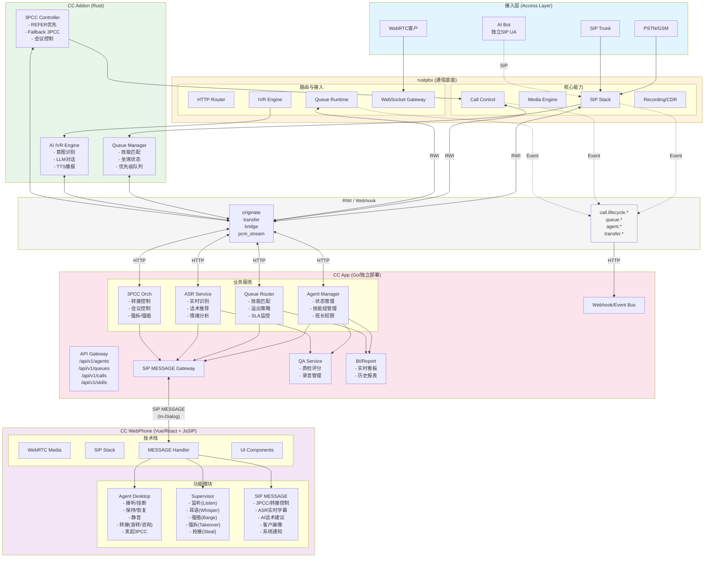
```mermaid
flowchart TB
    subgraph Access["接入层 (Access Layer)"]
        PSTN[PSTN/GSM]
        Trunk[SIP Trunk]
        WebRTC[WebRTC客户]
        AIBot["AI Bot<br/>独立SIP UA"]
    end
    
    subgraph Rustpbx["rustpbx (通信底座)"]
        subgraph Core["核心能力"]
            SIP[SIP Stack]
            Media[Media Engine]
            CallCtrl[Call Control]
            Record[Recording/CDR]
        end
        
        subgraph Router["路由与接入"]
            HTTP[HTTP Router]
            IVR[IVR Engine]
            Queue[Queue Runtime]
            WS[WebSocket Gateway]
        end
    end
    
    subgraph Addon["CC Addon (Rust)"]
        QueueMgr["Queue Manager<br/>- 技能匹配<br/>- 坐席状态<br/>- 优先级队列"]
        AIIVR["AI IVR Engine<br/>- 意图识别<br/>- LLM对话<br/>- TTS播报"]
        ThreePCC["3PCC Controller<br/>- REFER优先<br/>- Fallback 3PCC<br/>- 会议控制"]
    end
    
    subgraph RWI["RWI / Webhook"]
        RWIAPI["originate<br/>transfer<br/>bridge<br/>pcm_stream"]
        Webhook["call.lifecycle.*<br/>queue.*<br/>agent.*<br/>transfer.*"]
    end
    
    subgraph CCApp["CC App (Go/独立部署)"]
        APIGW["API Gateway<br/>/api/v1/agents<br/>/api/v1/queues<br/>/api/v1/calls<br/>/api/v1/skills"]
        
        subgraph Services["业务服务"]
            AgentMgr["Agent Manager<br/>- 状态管理<br/>- 技能组管理<br/>- 班长权限"]
            QueueRouter["Queue Router<br/>- 技能匹配<br/>- 溢出策略<br/>- SLA监控"]
            ASR["ASR Service<br/>- 实时识别<br/>- 话术推荐<br/>- 情绪分析"]
            Orch["3PCC Orch<br/>- 转接控制<br/>- 会议控制<br/>- 强拆/强插"]
        end
        
        MsgGW[SIP MESSAGE Gateway]
        QA["QA Service<br/>- 质检评分<br/>- 录音管理"]
        BI["BI/Report<br/>- 实时看板<br/>- 历史报表"]
        EB[Webhook/Event Bus]
    end
    
    subgraph WebPhone["CC WebPhone (Vue/React + JsSIP)"]
        subgraph Stack["技术栈"]
            WRTC[WebRTC Media]
            SIPStack[SIP Stack]
            MsgH[MESSAGE Handler]
            UI[UI Components]
        end
        
        subgraph Modules["功能模块"]
            Desktop["Agent Desktop<br/>- 接听/挂断<br/>- 保持/恢复<br/>- 静音<br/>- 转接(盲转/咨询)<br/>- 发起3PCC"]
            Super["Supervisor<br/>- 监听(Listen)<br/>- 耳语(Whisper)<br/>- 强插(Barge)<br/>- 强拆(Takeover)<br/>- 抢接(Steal)"]
            InMsg["SIP MESSAGE<br/>- 3PCC/转接控制<br/>- ASR实时字幕<br/>- AI话术建议<br/>- 客户画像<br/>- 系统通知"]
        end
    end
    
    %% 连接关系
    PSTN --> SIP
    Trunk --> SIP
    WebRTC --> WS
    AIBot -.->|SIP| SIP
    
    SIP <-->|RWI| RWIAPI
    CallCtrl <-->|RWI| RWIAPI
    Queue <-->|RWI| RWIAPI
    
    SIP -.->|Event| Webhook
    CallCtrl -.->|Event| Webhook
    Queue -.->|Event| Webhook
    
    SIP --> QueueMgr
    IVR --> AIIVR
    ThreePCC --> CallCtrl
    
    QueueMgr <--> RWIAPI
    AIIVR <--> RWIAPI
    ThreePCC <--> RWIAPI
    
    RWIAPI <-->|HTTP| AgentMgr
    RWIAPI <-->|HTTP| QueueRouter
    RWIAPI <-->|HTTP| ASR
    RWIAPI <-->|HTTP| Orch
    
    Webhook -->|HTTP| EB
    
    AgentMgr --> MsgGW
    QueueRouter --> MsgGW
    ASR --> MsgGW
    Orch --> MsgGW
    
    MsgGW <-->|"SIP MESSAGE<br/>(In-Dialog)"| MsgH
    
    MsgH --> Desktop
    MsgH --> Super
    MsgH --> InMsg
    
    AgentMgr --> QA
    AgentMgr --> BI
    QueueRouter --> BI
    ASR --> QA
    
    %% 样式
    style Access fill:#e1f5fe
    style Rustpbx fill:#fff3e0
    style Addon fill:#e8f5e9
    style CCApp fill:#fce4ec
    style WebPhone fill:#f3e5f5
    style RWI fill:#f5f5f5
    style Webhook fill:#f5f5f5
```

### 1.2 AI优先架构特点

```
传统IVR:  用户 → DTMF按键 → 固定菜单 → 转人工
            ↓
AI优先IVR: 用户 → 自然语言 → AI Bot理解 → 意图处理/信息收集 → 转人工(带完整上下文)
                              ↓
                         可直接解决 → 结束通话
```

---

## 2. 核心模块职责

| 模块 | 技术栈 | 核心职责 | 关键能力 |
|------|--------|----------|----------|
| **rustpbx** | Rust | 通信底座 | SIP/WebRTC、媒体桥接、RWI接口、基础IVR |
| **CC Addon** | Rust | 内核增强 | 队列调度引擎、技能匹配、AI IVR、3PCC控制器、PCM流输出 |
| **CC App** | Go | 业务编排 | 坐席管理、ASR服务、3PCC编排、In-Dialog消息、质检报表 |
| **CC WebPhone** | Vue/React+JsSIP | 坐席交互 | WebRTC通话、In-Dialog渲染、班长控制面板 |
| **AI Bot** | Python/Go | 智能接待 | ASR/LLM/TTS流水线、意图识别、上下文收集 |

---

## 3. 核心流程图

### 3.1 呼入流程：AI优先接待 → 转人工

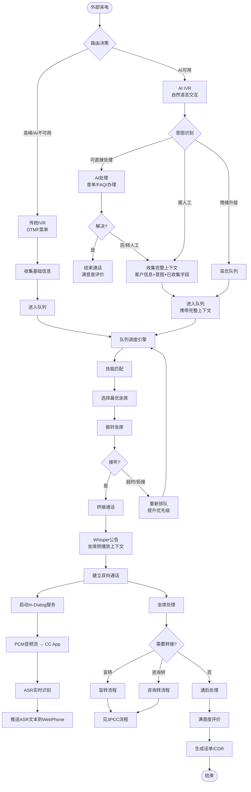
```mermaid
flowchart TD
    Start([外部来电]) --> Ingress{路由决策}
    Ingress -->|高峰/AI不可用| TraditionalIVR[传统IVR<br/>DTMF菜单]
    Ingress -->|AI可用| AIIVR[AI IVR<br/>自然语言交互]
    
    TraditionalIVR --> CollectInfo[收集基础信息]
    CollectInfo --> QueueEntry1[进入队列]
    
    AIIVR --> IntentDetect{意图识别}
    IntentDetect -->|可直接处理| AIProcess[AI处理<br/>查单/FAQ/办理]
    IntentDetect -->|需人工| ContextCollect[收集完整上下文<br/>客户信息+意图+已收集字段]
    IntentDetect -->|情绪升级| PriorityQueue[高优队列]
    
    AIProcess --> Resolved{解决?}
    Resolved -->|是| EndCall[结束通话<br/>满意度评价]
    Resolved -->|否/转人工| ContextCollect
    
    ContextCollect --> QueueEntry2[进入队列<br/>携带完整上下文]
    PriorityQueue --> QueueEntry2
    
    QueueEntry1 --> QueueEngine[队列调度引擎]
    QueueEntry2 --> QueueEngine
    
    QueueEngine --> SkillMatch[技能匹配]
    SkillMatch --> AgentSelect[选择最优坐席]
    AgentSelect --> Ringing[振铃坐席]
    
    Ringing --> Answer{接听?}
    Answer -->|是| Bridge[桥接通话]
    Answer -->|超时/拒接| Requeue[重新排队<br/>提升优先级]
    Requeue --> QueueEngine
    
    Bridge --> Whisper[Whisper公告<br/>坐席侧播放上下文]
    Whisper --> Connected[建立双向通话]
    
    Connected --> InDialogStart[启动In-Dialog服务]
    InDialogStart --> PCMStream[PCM音频流 → CC App]
    PCMStream --> ASRProcess[ASR实时识别]
    ASRProcess --> PushToPhone[推送ASR文本到WebPhone]
    
    Connected --> AgentHandle[坐席处理]
    AgentHandle --> Transfer{需要转接?}
    Transfer -->|盲转| BlindTransfer[盲转流程]
    Transfer -->|咨询转| AttendedTransfer[咨询转流程]
    Transfer -->|否| Wrapup[通后处理]
    
    BlindTransfer --> TransferFlow[见3PCC流程]
    AttendedTransfer --> TransferFlow
    
    Wrapup --> Survey[满意度评价]
    Survey --> CDR[生成话单/CDR]
    CDR --> End([结束])
```

### 3.2 3PCC转接流程 (盲转/咨询转) - In-Dialog 模式

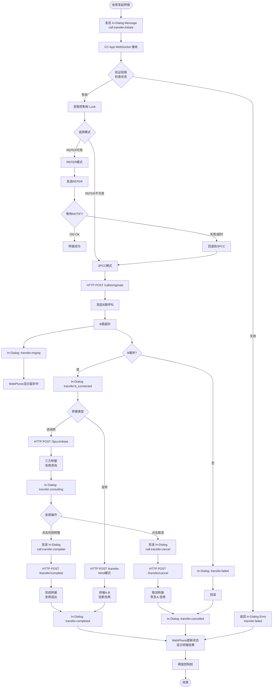
```mermaid
flowchart TD
    Start([坐席发起转接]) --> InDialogReq[发送 In-Dialog Message<br/>call.transfer.initiate]
    
    InDialogReq --> WSReceive[CC App WebSocket 接收]
    WSReceive --> Validate{验证权限<br/>检查状态}
    
    Validate -->|无效| ErrorResponse[返回 In-Dialog Error<br/>transfer.failed]
    Validate -->|有效| AcquireLock[获取控制权 Lock]
    
    AcquireLock --> SelectMode{选择模式}
    SelectMode -->|REFER可用| ReferMode[REFER模式]
    SelectMode -->|REFER不可用| ThreePCC[3PCC模式]
    
    ReferMode --> SendRefer[发送REFER]
    SendRefer --> WaitNotify{等待NOTIFY}
    WaitNotify -->|200 OK| ReferSuccess[转接成功]
    WaitNotify -->|失败/超时| Fallback[回退到3PCC]
    
    Fallback --> ThreePCC
    
    ThreePCC --> HTTPOriginate[HTTP POST /calls/originate]
    HTTPOriginate --> OriginateB[发起B路呼叫]
    OriginateB --> BRinging[B路振铃]
    
    BRinging --> InDialogRinging[In-Dialog: transfer.ringing]
    InDialogRinging --> WebPhoneShow[WebPhone显示振铃中]
    
    BRinging --> BAnswer{B接听?}
    BAnswer -->|否| InDialogFailed[In-Dialog: transfer.failed]
    BAnswer -->|是| InDialogConnected[In-Dialog: transfer.b_connected]
    
    InDialogConnected --> BridgeMode{转接类型}
    
    BridgeMode -->|盲转| HTTPBlind[HTTP POST /transfer<br/>blind模式]
    HTTPBlind --> BlindBridge[桥接A-B<br/>挂断坐席]
    
    BridgeMode -->|咨询转| HTTPConsult[HTTP POST /3pcc/initiate]
    HTTPConsult --> AttendedBridge[三方桥接<br/>坐席咨询]
    AttendedBridge --> InDialogConsult[In-Dialog: transfer.consulting]
    
    InDialogConsult --> Consult{坐席操作}
    Consult -->|点击完成转接| InDialogComplete[发送 In-Dialog<br/>call.transfer.complete]
    InDialogComplete --> HTTPComplete[HTTP POST /transfer/complete]
    HTTPComplete --> CompleteTransfer[完成转接<br/>坐席退出]
    
    Consult -->|点击取消| InDialogCancel[发送 In-Dialog<br/>call.transfer.cancel]
    InDialogCancel --> HTTPCancel[HTTP POST /transfer/cancel]
    HTTPCancel --> CancelTransfer[取消转接<br/>恢复A-坐席]
    CancelTransfer --> InDialogRestored[In-Dialog: transfer.cancelled]
    
    CompleteTransfer --> InDialogSuccess[In-Dialog: transfer.completed]
    BlindBridge --> InDialogSuccess
    
    InDialogFailed --> Rollback[回滚]
    Rollback --> InDialogRestored
    
    InDialogSuccess --> WebPhoneUpdate[WebPhone更新状态<br/>显示转接结果]
    InDialogRestored --> WebPhoneUpdate
    ErrorResponse --> WebPhoneUpdate
    
    WebPhoneUpdate --> ReleaseLock[释放控制权]
    ReleaseLock --> End([结束])
```

### 3.3 班长监控流程 (监听/耳语/强插/接管)

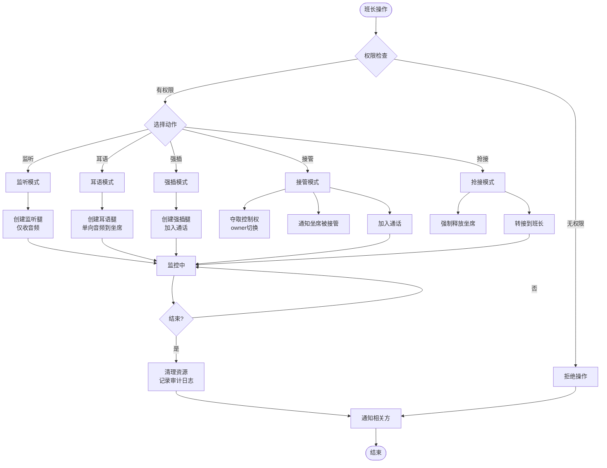
```mermaid
flowchart TD
    Start([班长操作]) --> CheckPermission{权限检查}
    CheckPermission -->|无权限| Deny[拒绝操作]
    CheckPermission -->|有权限| SelectAction{选择动作}
    
    SelectAction -->|监听| Listen[监听模式]
    SelectAction -->|耳语| Whisper[耳语模式]
    SelectAction -->|强插| Barge[强插模式]
    SelectAction -->|接管| Takeover[接管模式]
    SelectAction -->|抢接| Steal[抢接模式]
    
    Listen --> CreateListenLeg[创建监听腿<br/>仅收音频]
    Whisper --> CreateWhisperLeg[创建耳语腿<br/>单向音频到坐席]
    Barge --> CreateBargeLeg[创建强插腿<br/>加入通话]
    
    Takeover --> AcquireControl[夺取控制权<br/>owner切换]
    Takeover --> NotifyAgent[通知坐席被接管]
    Takeover --> JoinCall[加入通话]
    
    Steal --> ForceRelease[强制释放坐席]
    Steal --> TransferToSupervisor[转接到班长]
    
    CreateListenLeg --> MonitorActive[监控中]
    CreateWhisperLeg --> MonitorActive
    CreateBargeLeg --> MonitorActive
    JoinCall --> MonitorActive
    TransferToSupervisor --> MonitorActive
    
    MonitorActive --> MonitorEnd{结束?}
    MonitorEnd -->|是| Cleanup[清理资源<br/>记录审计日志]
    MonitorEnd -->|否| MonitorActive
    
    Cleanup --> NotifyResult[通知相关方]
    Deny --> NotifyResult
    
    NotifyResult --> End([结束])
```

### 3.4 SIP MESSAGE 处理流程 (3PCC/转接)

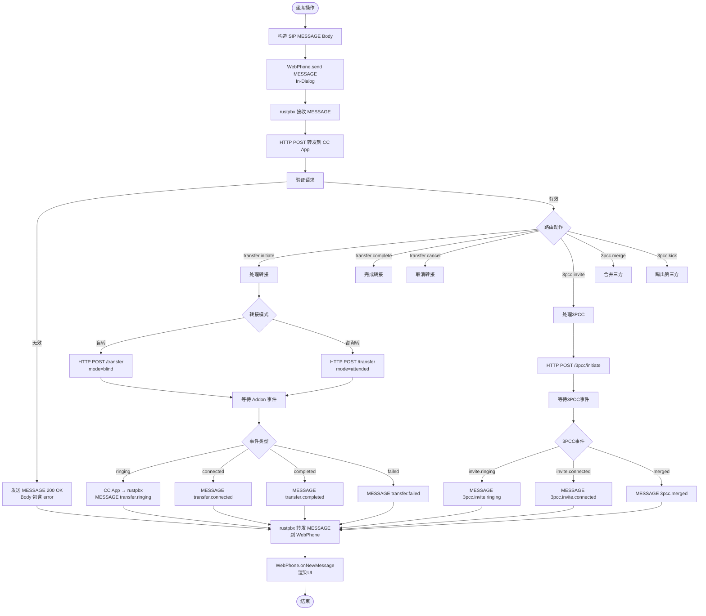
```mermaid
flowchart TD
    Start([坐席操作]) --> BuildMsg[构造 SIP MESSAGE Body]
    
    BuildMsg --> SIPSend[WebPhone.send MESSAGE<br/>In-Dialog]
    SIPSend --> RustpbxRecv[rustpbx 接收 MESSAGE]
    RustpbxRecv --> HTTPFwd[HTTP POST 转发到 CC App]
    
    HTTPFwd --> Validate[验证请求]
    Validate -->|无效| SIPError[发送 MESSAGE 200 OK<br/>Body 包含 error]
    Validate -->|有效| RouteAction{路由动作}
    
    RouteAction -->|transfer.initiate| HandleTransfer[处理转接]
    RouteAction -->|transfer.complete| HandleComplete[完成转接]
    RouteAction -->|transfer.cancel| HandleCancel[取消转接]
    RouteAction -->|3pcc.invite| Handle3PCC[处理3PCC]
    RouteAction -->|3pcc.merge| HandleMerge[合并三方]
    RouteAction -->|3pcc.kick| HandleKick[踢出第三方]
    
    HandleTransfer --> CheckMode{转接模式}
    CheckMode -->|盲转| HTTPBlind[HTTP POST /transfer<br/>mode=blind]
    CheckMode -->|咨询转| HTTPAttended[HTTP POST /transfer<br/>mode=attended]
    
    HTTPBlind --> WaitEvent[等待 Addon 事件]
    HTTPAttended --> WaitEvent
    
    Handle3PCC --> HTTP3PCC[HTTP POST /3pcc/initiate]
    HTTP3PCC --> Wait3PCCEvent[等待3PCC事件]
    
    WaitEvent --> EventReceived{事件类型}
    Wait3PCCEvent --> ThreePCCEvent{3PCC事件}
    
    EventReceived -->|ringing| MSGRinging[CC App → rustpbx<br/>MESSAGE transfer.ringing]
    EventReceived -->|connected| MSGConnected[MESSAGE transfer.connected]
    EventReceived -->|completed| MSGCompleted[MESSAGE transfer.completed]
    EventReceived -->|failed| MSGFailed[MESSAGE transfer.failed]
    
    ThreePCCEvent -->|invite.ringing| MSG3Ringing[MESSAGE 3pcc.invite.ringing]
    ThreePCCEvent -->|invite.connected| MSG3Connected[MESSAGE 3pcc.invite.connected]
    ThreePCCEvent -->|merged| MSG3Merged[MESSAGE 3pcc.merged]
    
    MSGRinging --> PushToPhone[rustpbx 转发 MESSAGE<br/>到 WebPhone]
    MSGConnected --> PushToPhone
    MSGCompleted --> PushToPhone
    MSGFailed --> PushToPhone
    SIPError --> PushToPhone
    MSG3Ringing --> PushToPhone
    MSG3Connected --> PushToPhone
    MSG3Merged --> PushToPhone
    
    PushToPhone --> Render[WebPhone.onNewMessage<br/>渲染UI]
    Render --> End([结束])
```

### 3.5 ASR实时辅助流程

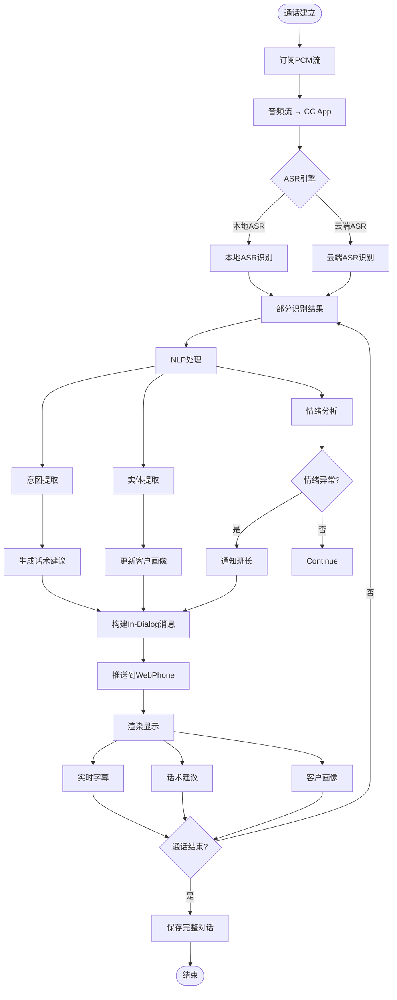
```mermaid
flowchart TD
    Start([通话建立]) --> SubscribePCM[订阅PCM流]
    SubscribePCM --> StreamToApp[音频流 → CC App]
    
    StreamToApp --> ASREngine{ASR引擎}
    ASREngine -->|本地ASR| LocalASR[本地ASR识别]
    ASREngine -->|云端ASR| CloudASR[云端ASR识别]
    
    LocalASR --> PartialResult[部分识别结果]
    CloudASR --> PartialResult
    
    PartialResult --> NLPProcess[NLP处理]
    NLPProcess --> IntentExtract[意图提取]
    NLPProcess --> Sentiment[情绪分析]
    NLPProcess --> EntityExtract[实体提取]
    
    IntentExtract --> Suggestion[生成话术建议]
    Sentiment --> Alert{情绪异常?}
    EntityExtract --> CustomerProfile[更新客户画像]
    
    Alert -->|是| SupervisorAlert[通知班长]
    Alert -->|否| Continue
    
    Suggestion --> BuildMessage[构建In-Dialog消息]
    CustomerProfile --> BuildMessage
    SupervisorAlert --> BuildMessage
    
    BuildMessage --> PushToAgent[推送到WebPhone]
    
    PushToAgent --> Display[渲染显示]
    Display --> ShowSubtitle[实时字幕]
    Display --> ShowSuggestion[话术建议]
    Display --> ShowProfile[客户画像]
    
    ShowSubtitle --> FinalCheck{通话结束?}
    ShowSuggestion --> FinalCheck
    ShowProfile --> FinalCheck
    
    FinalCheck -->|否| PartialResult
    FinalCheck -->|是| SaveTranscript[保存完整对话]
    SaveTranscript --> End([结束])
```

### 3.6 AI Bot独立接待流程

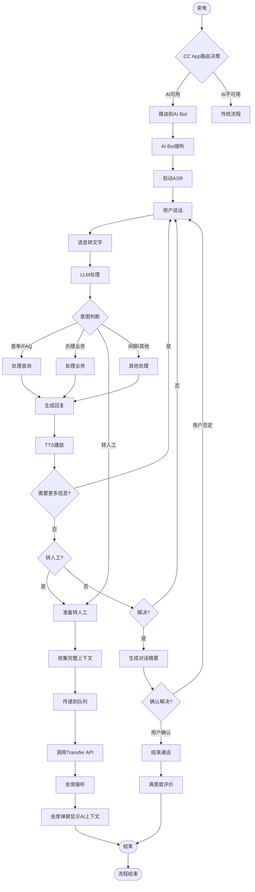
```mermaid
flowchart TD
    Start([来电]) --> RouterDecision{CC App路由决策}
    RouterDecision -->|AI可用| RouteToAI[路由到AI Bot]
    RouterDecision -->|AI不可用| Traditional[传统流程]
    
    RouteToAI --> AIBotReceive[AI Bot接听]
    AIBotReceive --> ASRStart[启动ASR]
    
    ASRStart --> UserSpeak[用户说话]
    UserSpeak --> SpeechToText[语音转文字]
    SpeechToText --> LLMProcess[LLM处理]
    
    LLMProcess --> IntentCheck{意图判断}
    IntentCheck -->|查单/FAQ| HandleQuery[处理查询]
    IntentCheck -->|办理业务| HandleTransaction[处理业务]
    IntentCheck -->|转人工| Handoff[准备转人工]
    IntentCheck -->|闲聊/其他| HandleOther[其他处理]
    
    HandleQuery --> GenerateResponse[生成回复]
    HandleTransaction --> GenerateResponse
    HandleOther --> GenerateResponse
    
    GenerateResponse --> TTSSpeak[TTS播放]
    TTSSpeak --> NeedMore{需要更多信息?}
    
    NeedMore -->|是| UserSpeak
    NeedMore -->|否| HandoffCheck{转人工?}
    
    HandoffCheck -->|是| Handoff
    HandoffCheck -->|否| Resolved{解决?}
    
    Resolved -->|否| UserSpeak
    Resolved -->|是| AISummary[生成对话摘要]
    
    Handoff --> CollectContext[收集完整上下文]
    CollectContext --> ContextToQueue[传递到队列]
    ContextToQueue --> TransferAPI[调用Transfer API]
    
    AISummary --> AIVerify{确认解决?}
    AIVerify -->|用户确认| EndCall[结束通话]
    AIVerify -->|用户否定| UserSpeak
    
    EndCall --> Survey[满意度评价]
    TransferAPI --> AgentAnswer[坐席接听]
    
    Survey --> End([结束])
    AgentAnswer --> ShowContext[坐席弹屏显示AI上下文]
    ShowContext --> End
    
    End --> Final([流程结束])
```

---

## 4. SIP MESSAGE (In-Dialog) 控制机制

### 4.1 为什么使用 SIP MESSAGE

传统呼叫中心控制方式的问题：

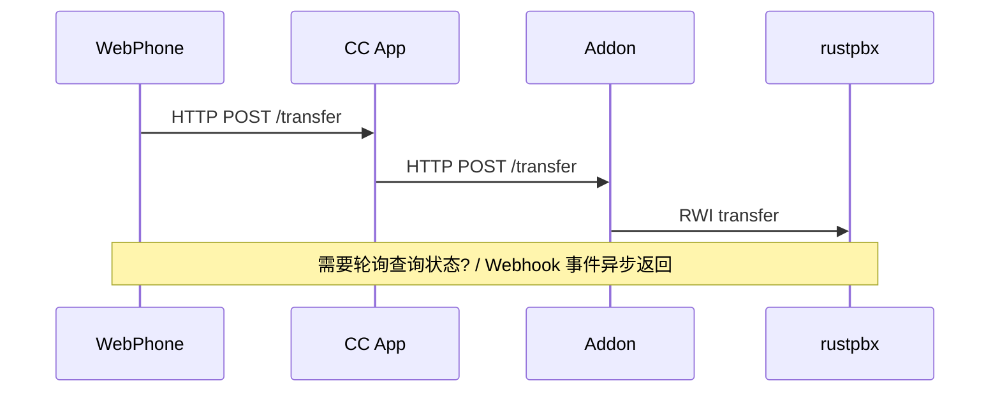
```mermaid
sequenceDiagram
    participant W as WebPhone
    participant C as CC App
    participant A as Addon
    participant R as rustpbx
    
    W->>C: HTTP POST /transfer
    C->>A: HTTP POST /transfer
    A->>R: RWI transfer
    Note over W,R: 需要轮询查询状态? / Webhook 事件异步返回
```

**问题:**
1. 控制命令和状态分离，需要轮询或额外通道
2. 不支持实时的中间状态反馈 (如振铃中、对方接听等)
3. 浏览器端 HTTP 调用跨域、鉴权复杂
4. 与 SIP 通话状态不同步

SIP MESSAGE (In-Dialog) 方式：

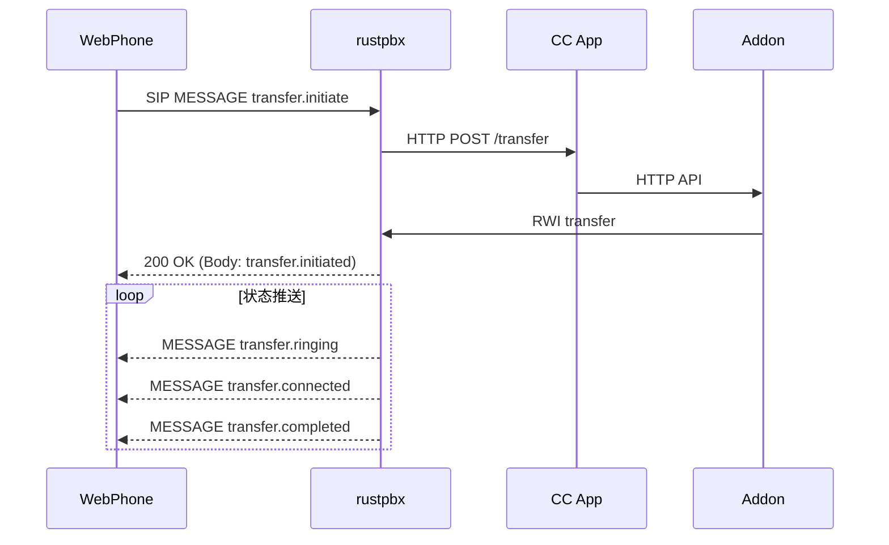
```mermaid
sequenceDiagram
    participant W as WebPhone
    participant R as rustpbx
    participant C as CC App
    participant A as Addon
    
    W->>R: SIP MESSAGE transfer.initiate
    R->>C: HTTP POST /transfer
    C->>A: HTTP API
    A->>R: RWI transfer
    R-->>W: 200 OK (Body: transfer.initiated)
    
    loop 状态推送
        R-->>W: MESSAGE transfer.ringing
        R-->>W: MESSAGE transfer.connected
        R-->>W: MESSAGE transfer.completed
    end
```

**优势:**
1. 标准 SIP 方法，与通话使用同一 Call-ID，天然 In-Dialog
2. rustpbx 作为网关，统一转发到 CC App
3. 支持请求-响应模式，每个 command 都有对应的 event
4. 中间状态通过 MESSAGE 推送，实时性好
5. JsSIP 等库原生支持 MESSAGE

### 4.2 SIP MESSAGE 交互模式

#### 模式一：请求-响应 (Request-Response)
适用于需要明确结果的操作：

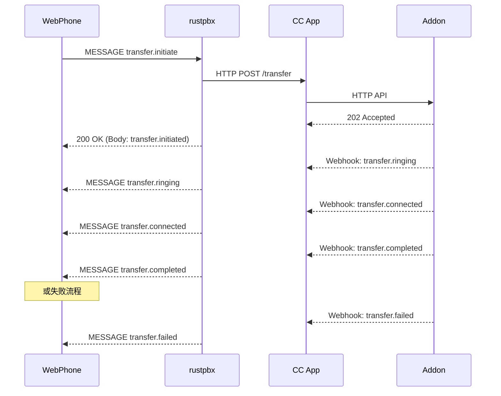
```mermaid
sequenceDiagram
    participant W as WebPhone
    participant R as rustpbx
    participant C as CC App
    participant A as Addon
    
    W->>R: MESSAGE transfer.initiate
    R->>C: HTTP POST /transfer
    C->>A: HTTP API
    A-->>C: 202 Accepted
    R-->>W: 200 OK (Body: transfer.initiated)
    
    A-->>C: Webhook: transfer.ringing
    R-->>W: MESSAGE transfer.ringing
    
    A-->>C: Webhook: transfer.connected
    R-->>W: MESSAGE transfer.connected
    
    A-->>C: Webhook: transfer.completed
    R-->>W: MESSAGE transfer.completed
    
    Note over W: 或失败流程
    A-->>C: Webhook: transfer.failed
    R-->>W: MESSAGE transfer.failed
```

#### 模式二：订阅-推送 (Subscribe-Push)
适用于 ASR 等持续数据流：

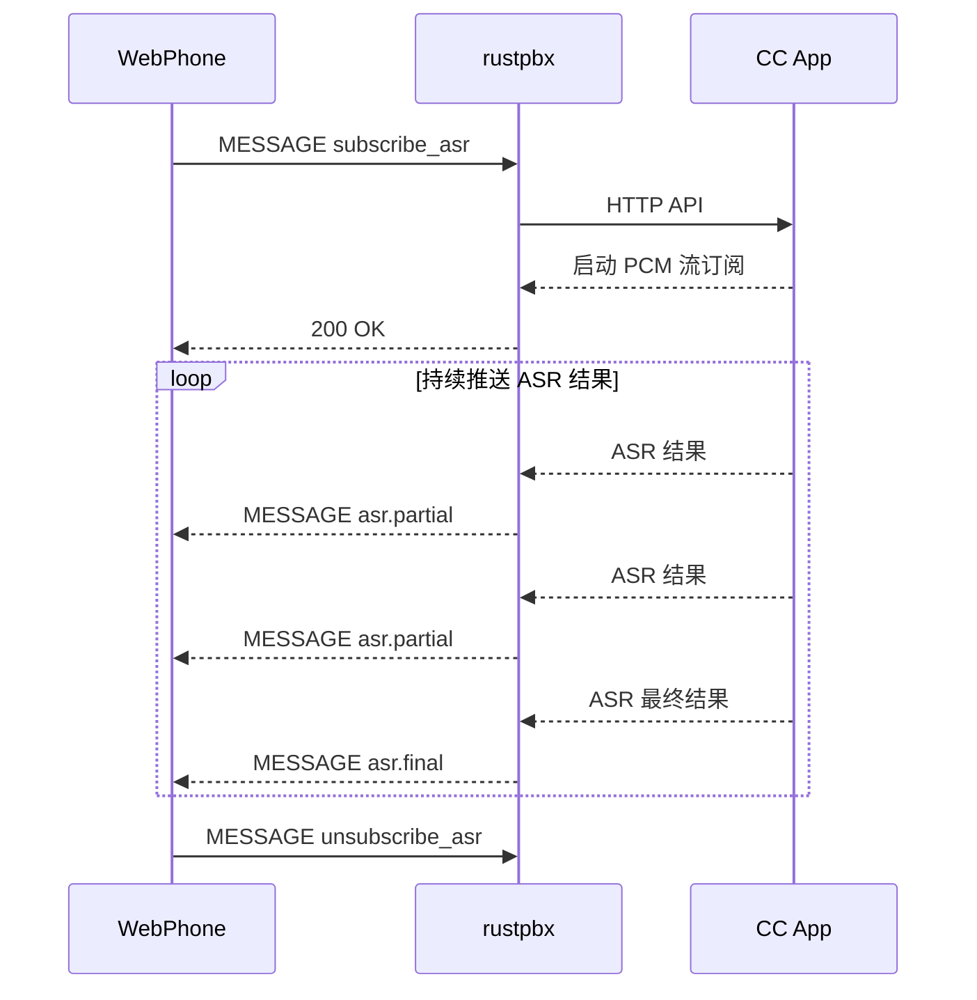
```mermaid
sequenceDiagram
    participant W as WebPhone
    participant R as rustpbx
    participant C as CC App
    
    W->>R: MESSAGE subscribe_asr
    R->>C: HTTP API
    C-->>R: 启动 PCM 流订阅
    R-->>W: 200 OK
    
    loop 持续推送 ASR 结果
        C-->>R: ASR 结果
        R-->>W: MESSAGE asr.partial
        C-->>R: ASR 结果
        R-->>W: MESSAGE asr.partial
        C-->>R: ASR 最终结果
        R-->>W: MESSAGE asr.final
    end
    
    W->>R: MESSAGE unsubscribe_asr
```

#### 模式三：通知 (Notification)
适用于系统主动推送：

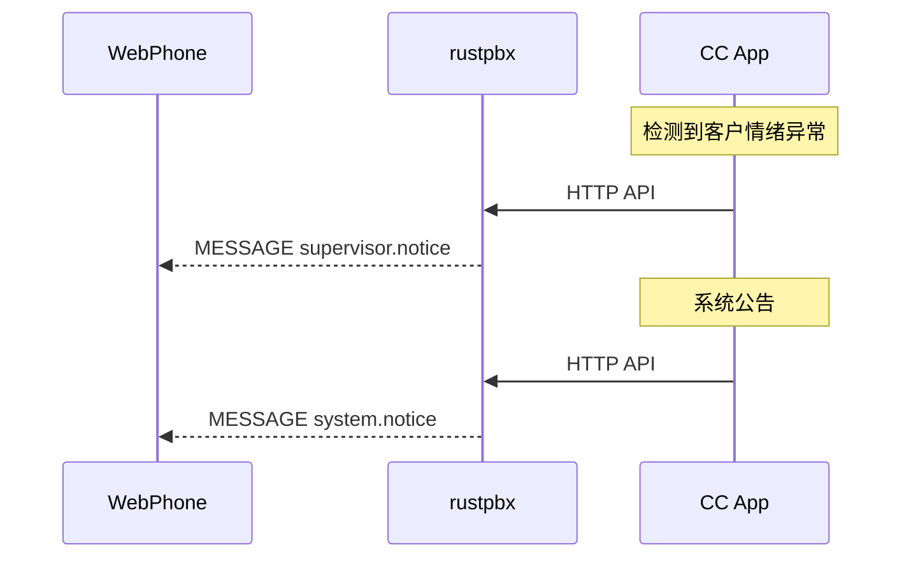
```mermaid
sequenceDiagram
    participant W as WebPhone
    participant R as rustpbx
    participant C as CC App
    
    Note over C: 检测到客户情绪异常
    C->>R: HTTP API
    R-->>W: MESSAGE supervisor.notice
    
    Note over C: 系统公告
    C->>R: HTTP API  
    R-->>W: MESSAGE system.notice
```

### 4.3 SIP MESSAGE 3PCC 完整示例

```javascript
// ===== 场景：坐席在通话中邀请技术专家咨询 =====
// 使用 JsSIP 发送 SIP MESSAGE

// Step 1: 坐席点击"咨询专家"，发送 SIP MESSAGE
const message = ua.sendMessage('sip:cc@rustpbx.example.com', JSON.stringify({
  message_id: 'req-consult-001',
  type: 'call.3pcc.invite',
  payload: {
    invite_id: 'inv-001',
    target: 'agent:expert-001',
    target_name: '技术专家-李工',
    purpose: 'consult',
    options: {
      timeout_secs: 60,
      whisper_to_agent: true
    }
  }
}), {
  contentType: 'application/vnd.cc+json'
});

message.on('succeeded', (data) => {
  // Step 2: 收到 200 OK 确认
  // data.body = { type: 'response.ok', payload: { invite_id: 'inv-001', status: 'initiated' } }
});

// Step 3: 专家振铃，收到 rustpbx 转发的 MESSAGE
ua.on('newMessage', (data) => {
  const msg = JSON.parse(data.request.body);
  
  if (msg.type === '3pcc.invite.ringing') {
    // UI 显示"呼叫中..."
    showToast(`正在呼叫 ${msg.payload.target_name}...`);
  }
  
  // Step 4: 专家接听，进入咨询模式
  if (msg.type === '3pcc.invite.connected') {
    // UI 显示：客户[保持中] | 你 <-> 技术专家-李工[咨询中]
    showConsultPanel(msg.payload);
  }
});

// Step 5: 坐席点击"合并三方"unction mergeConference() {
  ua.sendMessage('sip:cc@rustpbx.example.com', JSON.stringify({
    message_id: 'req-merge-001',
    type: 'call.3pcc.merge',
    payload: {
      invite_id: 'inv-001',
      mode: 'all'
    }
  }), { contentType: 'application/vnd.cc+json' });
}

// Step 6: 三方合并成功
ua.on('newMessage', (data) => {
  const msg = JSON.parse(data.request.body);
  
  if (msg.type === '3pcc.merged') {
    // UI 显示：三方通话界面
    showConferencePanel(msg.payload.participants);
  }
});

// Step 7: 咨询结束，坐席点击"让专家离开"unction kickExpert() {
  ua.sendMessage('sip:cc@rustpbx.example.com', JSON.stringify({
    message_id: 'req-kick-001',
    type: 'call.3pcc.kick',
    payload: {
      invite_id: 'inv-001',
      target: 'expert-001'
    }
  }), { contentType: 'application/vnd.cc+json' });
}

// Step 8: 专家退出
ua.on('newMessage', (data) => {
  const msg = JSON.parse(data.request.body);
  
  if (msg.type === '3pcc.left') {
    // 恢复客户-坐席通话
    showCustomerPanel();
  }
});
```

### 4.4 SIP MESSAGE 格式规范

```
MESSAGE sip:cc@rustpbx.example.com SIP/2.0
Via: SIP/2.0/WSS 192.168.1.100:5060;branch=z9hG4bK776asdhds
Max-Forwards: 70
To: <sip:cc@rustpbx.example.com>;tag=a6c85cf
From: <sip:agent-001@rustpbx.example.com>;tag=1928301774
Call-ID: a84b4c76e66710  <-- 与当前通话相同的 Call-ID (In-Dialog)
CSeq: 314159 MESSAGE
Content-Type: application/vnd.cc+json
Content-Length: ...

{
  "message_id": "req-001",
  "type": "call.transfer.initiate",
  "payload": {
    "target": "agent:agent-002",
    "mode": "attended"
  }
}
```

**关键 Header：**
- `Call-ID`: 必须与当前通话相同，确保 MESSAGE 是 In-Dialog 的
- `Content-Type: application/vnd.cc+json`: CC 自定义消息类型
- `To/From`: 标准 SIP URI

**响应格式：**
```
SIP/2.0 200 OK
Via: SIP/2.0/WSS 192.168.1.100:5060;branch=z9hG4bK776asdhds
From: <sip:agent-001@rustpbx.example.com>;tag=1928301774
To: <sip:cc@rustpbx.example.com>;tag=a6c85cf
Call-ID: a84b4c76e66710
CSeq: 314159 MESSAGE
Content-Type: application/vnd.cc+json
Content-Length: ...

{
  "type": "response.ok",
  "ref_message_id": "req-001",
  "payload": { "status": "initiated" }
}
```

---

## 5. 数据流图

### 5.1 通话状态数据流

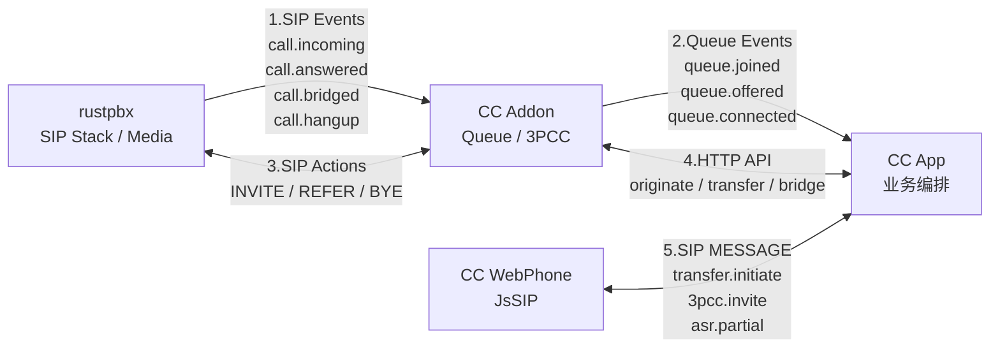
```mermaid
flowchart LR
    R["rustpbx<br/>SIP Stack / Media"]
    A["CC Addon<br/>Queue / 3PCC"]
    C["CC App<br/>业务编排"]
    W["CC WebPhone<br/>JsSIP"]
    
    R -->|"1.SIP Events<br/>call.incoming<br/>call.answered<br/>call.bridged<br/>call.hangup"| A
    A -->|"2.Queue Events<br/>queue.joined<br/>queue.offered<br/>queue.connected"| C
    A <-->|"3.SIP Actions<br/>INVITE / REFER / BYE"| R
    C <-->|"4.HTTP API<br/>originate / transfer / bridge"| A
    W <-->|"5.SIP MESSAGE<br/>transfer.initiate<br/>3pcc.invite<br/>asr.partial"| C
```

### 5.2 ASR数据流

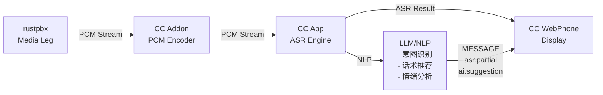
```mermaid
flowchart LR
    R["rustpbx<br/>Media Leg"]
    A["CC Addon<br/>PCM Encoder"]
    C["CC App<br/>ASR Engine"]
    W["CC WebPhone<br/>Display"]
    NLP["LLM/NLP<br/>- 意图识别<br/>- 话术推荐<br/>- 情绪分析"]
    
    R -->|PCM Stream| A
    A -->|PCM Stream| C
    C -->|ASR Result| W
    C -->|NLP| NLP
    NLP -->|MESSAGE<br/>asr.partial<br/>ai.suggestion| W
```

---

## 6. 接口设计要点

### 6.0 通信通道职责划分

基于 rustpbx 已有能力，CC 系统使用 **三层通信通道**：

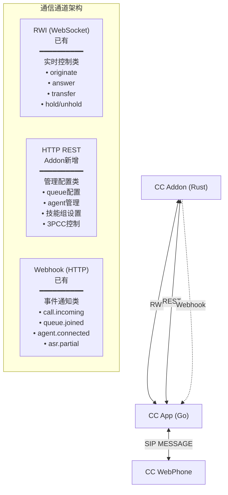
```mermaid
flowchart TB
    subgraph "通信通道架构"
        RWI["RWI (WebSocket)<br/>已有<br/>━━━━━━━━━━<br/>实时控制类<br/>• originate<br/>• answer<br/>• transfer<br/>• hold/unhold"]
        
        REST["HTTP REST<br/>Addon新增<br/>━━━━━━━━━━<br/>管理配置类<br/>• queue配置<br/>• agent管理<br/>• 技能组设置<br/>• 3PCC控制"]
        
        Webhook["Webhook (HTTP)<br/>已有<br/>━━━━━━━━━━<br/>事件通知类<br/>• call.incoming<br/>• queue.joined<br/>• agent.connected<br/>• asr.partial"]
    end
    
    Addon["CC Addon (Rust)"]
    App["CC App (Go)"]
    Phone["CC WebPhone"]
    
    Addon <-->|RWI| App
    Addon <-->|REST| App
    Addon -.->|Webhook| App
    App <-->|SIP MESSAGE| Phone
```

| 通道 | 方向 | 协议 | 用途 | 示例 |
|------|------|------|------|------|
| **RWI** | 双向 | WebSocket | 实时控制 | originate, answer, bridge, transfer |
| **HTTP REST** | App → Addon | HTTP | 管理配置 | queue.enqueue, agent.login, 3pcc |
| **Webhook** | Addon → App | HTTP POST | 事件通知 | call.answered, queue.agent_connected |
| **SIP MESSAGE** | 双向 | SIP | WebPhone控制 | transfer.initiate, asr.partial |

**设计原则：**
1. **RWI 保持现状**：已有的实时控制通道继续使用
2. **Addon 新增 HTTP REST**：供 CC App 管理队列、坐席、配置
3. **Webhook 保持现状**：Addon 推送事件给 CC App
4. **SIP MESSAGE**：WebPhone 与 rustpbx 之间的 In-Dialog 控制

### 6.1 Addon HTTP REST 接口 (CC App → Addon)

#### 6.1.1 队列管理接口

```http
# 呼叫入队
POST /api/v1/queues/{queue_id}/enqueue
Content-Type: application/json

{
  "call_id": "call-abc-123",
  "priority": 3,
  "required_skills": ["billing", "english"],
  "context": {
    "ivr_name": "main_ivr",
    "menu_path": "root->support->billing",
    "account_id": "ACC123456",
    "caller_intent": "refund_request"
  }
}

Response: 200 OK
{
  "entry_id": "entry-xyz-789",
  "position": 2,
  "estimated_wait_secs": 120
}

# 呼叫出队
POST /api/v1/queues/{queue_id}/dequeue
{
  "call_id": "call-abc-123",
  "reason": "agent_answered"
}

# 坐席登录队列
POST /api/v1/agents/{agent_id}/login
{
  "queues": ["support", "sales"],
  "skills": [
    {"name": "billing", "level": 4},
    {"name": "english", "level": 5}
  ],
  "priority": 1
}

# 坐席登出队列
POST /api/v1/agents/{agent_id}/logout
{
  "queues": ["support"]
}

# 更新坐席状态
POST /api/v1/agents/{agent_id}/presence
{
  "state": "ready",  // ready, not_ready, wrap_up, break
  "reason_code": "lunch",
  "timestamp": "2026-04-10T10:30:00Z"
}
```

#### 6.1.2 呼叫控制接口

```http
# 发起呼叫
POST /api/v1/calls/originate
{
  "caller": "sip:agent001@cc.example.com",
  "callee": "sip:customer@carrier.com",
  "call_id": "call-new-456",
  "options": {
    "timeout_secs": 30,
    "auto_answer": false
  }
}

Response: 202 Accepted
{
  "session_id": "sess-789",
  "status": "originating"
}

# 转接呼叫
POST /api/v1/calls/{call_id}/transfer
{
  "target": "agent:agent002",  // 或 "queue:support", "sip:xxx"
  "mode": "attended",          // blind, attended
  "prefer_refer": true,
  "context": {
    "transfer_reason": "escalation",
    "notes": "客户要求退款"
  }
}

Response: 202 Accepted
{
  "transfer_id": "xfer-123",
  "status": "initiated",
  "mode": "refer"  // 或 "3pcc"
}

# 3PCC 控制
POST /api/v1/calls/{call_id}/3pcc
{
  "action": "initiate",     // initiate, merge, cancel, bridge
  "target": "sip:consultant@cc.example.com",
  "leg_id": "leg-a",
  "options": {
    "consult_timeout_secs": 60
  }
}

Response: 202 Accepted
{
  "operation_id": "3pcc-456",
  "status": "dialing"
}

# 保持/恢复通话
POST /api/v1/calls/{call_id}/hold
POST /api/v1/calls/{call_id}/unhold

# 挂断通话
POST /api/v1/calls/{call_id}/hangup
{
  "reason": "normal_clearing"
}
```

#### 6.1.3 班长监控接口

```http
# 获取可监控的通话列表
GET /api/v1/supervisor/calls?status=connected&agent_id=*

Response: 200 OK
{
  "calls": [
    {
      "call_id": "call-001",
      "agent_id": "agent-001",
      "agent_name": "张三",
      "customer_number": "138****1234",
      "duration_secs": 120,
      "queue_id": "support"
    }
  ]
}

# 监听通话
POST /api/v1/supervisor/calls/{call_id}/listen
{
  "supervisor_id": "sup-001",
  "mode": "listen"  // listen, whisper, barge
}

Response: 200 OK
{
  "monitor_leg_id": "mon-leg-789",
  "ws_url": "wss://cc.example.com/ws/monitor/mon-leg-789"
}

# 耳语 (对坐席说话，客户听不到)
POST /api/v1/supervisor/calls/{call_id}/whisper
{
  "supervisor_id": "sup-001",
  "message": "注意服务态度"
}

# 强插 (加入通话，三方都能听到)
POST /api/v1/supervisor/calls/{call_id}/barge
{
  "supervisor_id": "sup-001"
}

# 接管通话
POST /api/v1/supervisor/calls/{call_id}/takeover
{
  "supervisor_id": "sup-001",
  "release_agent": true
}

# 抢接通话 (坐席离线时)
POST /api/v1/supervisor/calls/{call_id}/steal
{
  "supervisor_id": "sup-001",
  "target_agent": "agent-001"
}
```

#### 6.1.4 PCM 音频流接口

```http
# 启动 PCM 流推送
POST /api/v1/calls/{call_id}/streams
{
  "stream_type": "pcm",
  "direction": "both",      // inbound, outbound, both
  "sample_rate": 8000,
  "format": "s16le",        // s16le, f32le
  "target": {
    "type": "websocket",    // websocket, http_post
    "url": "wss://cc-app.example.com/ws/asr/{call_id}"
  }
}

Response: 201 Created
{
  "stream_id": "stream-abc",
  "ws_url": "wss://rustpbx.example.com/ws/pcm/stream-abc",
  "started_at": "2026-04-10T10:30:00Z"
}

# 停止 PCM 流
DELETE /api/v1/calls/{call_id}/streams/{stream_id}

# 获取活跃流列表
GET /api/v1/calls/{call_id}/streams
```

#### 6.1.5 WebSocket/SIP 连接管理

```javascript
// ===== Addon → CC App 事件流 (Webhook/HTTP回调) =====
// CC App 提供 HTTP Endpoint 接收事件
// POST /webhook/call-events
// POST /webhook/queue-events

// ===== WebPhone → rustpbx → CC App (SIP MESSAGE) =====
// 使用 JsSIP 库

const ua = new JsSIP.UA({
  uri: 'sip:agent-001@rustpbx.example.com',
  ws_servers: 'wss://rustpbx.example.com/ws',
  // ...
});

ua.start();

// 发起 SIP MESSAGE
function sendCCMessage(body) {
  const message = ua.sendMessage(
    'sip:cc@rustpbx.example.com',  // CC 服务 URI
    JSON.stringify(body),
    { contentType: 'application/vnd.cc+json' }
  );
  return message;
}

// WebPhone 发起转接 (通过 SIP MESSAGE)
sendCCMessage({
  message_id: 'req-001',
  type: 'call.transfer.initiate',
  payload: {
    target: 'agent:agent-002',
    mode: 'attended',
    context: { reason: '技术咨询' }
  }
});

// 接收 MESSAGE 事件
ua.on('newMessage', (data) => {
  const msg = JSON.parse(data.request.body);
  switch(msg.type) {
    case 'transfer.ringing':
      showToast(`正在呼叫 ${msg.payload.target_info.agent_name}...`);
      break;
    case 'transfer.connected':
      showConsultPanel(msg.payload);
      break;
    case 'transfer.completed':
      showToast('转接完成');
      closeCall();  // 坐席挂断
      break;
    case 'transfer.failed':
      showError(`转接失败: ${msg.payload.reason}`);
      if(msg.payload.can_retry) {
        showRetryButton();
      }
      break;
    case 'asr.partial':
      updateSubtitle(msg.payload.text, msg.payload.speaker);
      break;
    case 'ai.suggestion':
      showSuggestion(msg.payload.suggestions);
      break;
  }
};
```

### 6.2 In-Dialog Message 协议

```typescript
// 从 CC App 推送到 CC WebPhone
interface InDialogMessage {
  message_id: string;
  call_id: string;
  timestamp: number;
  sequence: number;  // 用于乱序纠正
  type: InDialogType;
  payload: unknown;
}

type InDialogType = 
  | 'asr.partial'      // ASR部分识别
  | 'asr.final'        // ASR最终识别
  | 'ai.suggestion'    // AI话术建议
  | 'customer.profile' // 客户画像更新
  | 'transfer.result'  // 转接结果
  | 'supervisor.notice' // 班长通知
  | 'queue.update';    // 队列状态更新

// 示例: ASR消息
interface ASRPartialPayload {
  text: string;
  is_final: boolean;
  confidence: number;
  speaker: 'customer' | 'agent';
}

// 示例: 话术建议
interface SuggestionPayload {
  intent: string;
  suggestions: Array<{
    text: string;
    score: number;
    category: 'faq' | 'solution' | 'escalation';
  }>;
}
```

### 6.3 SIP MESSAGE 控制协议

WebPhone 与 rustpbx 之间通过 **SIP MESSAGE** 方法传递控制指令，rustpbx 转发给 CC App 处理。所有 MESSAGE 都使用与通话相同的 `Call-ID`，确保 In-Dialog。

#### 6.3.1 坐席 → CC App (MESSAGE 请求)

```typescript
// SIP MESSAGE Body 格式
interface CCMessageRequest {
  message_id: string;        // 客户端生成的唯一ID
  type: CCMessageType;
  payload: unknown;
}

type CCMessageType =
  // 通话基础控制
  | 'call.answer'            // 接听
  | 'call.hangup'            // 挂断
  | 'call.hold'              // 保持
  | 'call.unhold'            // 恢复
  | 'call.mute'              // 静音
  | 'call.unmute'            // 取消静音
  | 'call.dtmf'              // 发送DTMF
  
  // 转接控制 (核心)
  | 'call.transfer.initiate' // 发起转接/咨询
  | 'call.transfer.complete' // 完成转接
  | 'call.transfer.cancel'   // 取消转接
  
  // 三方通话控制 (3PCC)
  | 'call.3pcc.invite'       // 邀请第三方
  | 'call.3pcc.merge'        // 合并为三方
  | 'call.3pcc.kick'         // 踢出第三方
  | 'call.3pcc.leave'        // 坐席离开(客户与第三方继续)
  
  // 状态更新
  | 'presence.update';       // 坐席状态更新

// ========== 转接请求 Payload ==========

// 1. 发起转接 (盲转或咨询转)
interface TransferInitiatePayload {
  transfer_id?: string;      // 可选，不传则由服务端生成
  target: string;            // 目标: agent:xxx / queue:xxx / sip:xxx / tel:xxx
  mode: 'blind' | 'attended'; // 盲转或咨询转
  context?: {
    reason?: string;         // 转接原因
    notes?: string;          // 备注
    priority?: number;       // 优先级
  };
}

// SIP MESSAGE 示例: 发起咨询转
{
  "message_id": "req-001",
  "type": "call.transfer.initiate",
  "payload": {
    "target": "agent:agent-002",
    "mode": "attended",
    "context": {
      "reason": "技术咨询",
      "notes": "客户询问退款流程"
    }
  }
}

// 2. 完成转接 (咨询转后确认)
interface TransferCompletePayload {
  transfer_id: string;       // 转接ID
  action: 'complete' | 'return'; // complete=完成转接, return=返回客户
}

// 3. 取消转接
interface TransferCancelPayload {
  transfer_id: string;
  reason?: string;
}

// ========== 3PCC 请求 Payload ==========

interface ThreePCCInvitePayload {
  invite_id?: string;
  target: string;
  target_name?: string;
  purpose: 'consult' | 'conference' | 'transfer';
  options?: {
    timeout_secs?: number;
    whisper_to_agent?: boolean;
  };
}

interface ThreePCCMergePayload {
  invite_id: string;
  mode: 'all' | 'agent_customer' | 'agent_third' | 'customer_third';
}

interface ThreePCCKickPayload {
  invite_id: string;
  target: string;
  reason?: string;
}
```

#### 6.3.2 CC App → 坐席 (MESSAGE 响应与事件)

```typescript
// SIP MESSAGE Body 格式 (服务端发送)
interface CCMessageResponse {
  type: CCMessageResponseType;
  ref_message_id?: string;   // 引用的请求ID
  payload: unknown;
}

type CCMessageResponseType =
  // 请求响应
  | 'response.ok'            // 请求成功
  | 'response.error'         // 请求失败
  
  // 转接事件
  | 'transfer.initiated'     // 转接已发起
  | 'transfer.ringing'       // 目标振铃中
  | 'transfer.connected'     // 目标已接通
  | 'transfer.completed'     // 转接完成
  | 'transfer.failed'        // 转接失败
  | 'transfer.cancelled'     // 转接已取消
  
  // 3PCC事件
  | '3pcc.invite.ringing'    // 第三方振铃
  | '3pcc.invite.connected'  // 第三方接通
  | '3pcc.invite.failed'     // 邀请失败
  | '3pcc.merged'            // 已合并三方
  | '3pcc.left'              // 某方离开
  
  // ASR/AI 辅助
  | 'asr.partial'            // ASR部分识别
  | 'asr.final'              // ASR最终识别
  | 'ai.suggestion'          // AI话术建议
  | 'customer.profile'       // 客户画像更新
  
  // 系统通知
  | 'system.notice'          // 系统通知
  | 'supervisor.notice';     // 班长通知

// ========== 转接响应 Payload ==========

// 转接发起成功 (200 OK Body)
interface TransferInitiatedPayload {
  transfer_id: string;
  mode: 'blind' | 'attended';
  actual_mode: 'refer' | '3pcc';
  status: 'initiated';
}

// 目标振铃中
interface TransferRingingPayload {
  transfer_id: string;
  target: string;
  target_info?: {
    agent_id?: string;
    agent_name?: string;
    queue_id?: string;
    queue_name?: string;
  };
}

// 目标已接通 (咨询转时)
interface TransferConnectedPayload {
  transfer_id: string;
  target: string;
  consult_session_id: string;
  can_merge: boolean;        // 是否可合并三方
  can_return: boolean;       // 是否可返回客户
}

// 转接完成
interface TransferCompletedPayload {
  transfer_id: string;
  result: 'success';
  new_call_id?: string;      // 转接后的新通话ID
  duration_secs?: number;    // 咨询时长
}

// 转接失败
interface TransferFailedPayload {
  transfer_id: string;
  reason: string;
  reason_code: 
    | 'target_busy' 
    | 'target_offline' 
    | 'timeout' 
    | 'rejected' 
    | 'network_error'
    | 'no_permission';
  can_retry: boolean;
  fallback_options?: string[];
}

// 示例: 转接失败
{
  "message_id": "evt-001",
  "call_id": "call-abc-123",
  "timestamp": 1712713220000,
  "sequence": 10,
  "type": "transfer.failed",
  "ref_message_id": "req-001",
  "payload": {
    "transfer_id": "xfer-789",
    "reason": "目标坐席忙线",
    "reason_code": "target_busy",
    "can_retry": true,
    "fallback_options": ["queue:general", "voicemail"]
  }
}

// ========== 3PCC 事件 Payload ==========

// 第三方振铃
interface ThreePCCRingingPayload {
  invite_id: string;
  target: string;
  target_name?: string;
  purpose: 'consult' | 'conference' | 'transfer';
}

// 第三方接通
interface ThreePCCConnectedPayload {
  invite_id: string;
  target: string;
  target_name?: string;
  session_id: string;
  is_consulting: boolean;    // 是否为咨询模式
}

// 已合并为三方
interface ThreePCCMergedPayload {
  invite_id: string;
  participants: Array<{
    role: 'customer' | 'agent' | 'third';
    id: string;
    name?: string;
    muted?: boolean;
  }>;
  can_kick: boolean;         // 坐席是否有权限踢人
  can_leave: boolean;        // 坐席是否可以离开
}

// 某方离开
interface ThreePCCLeftPayload {
  invite_id: string;
  participant: {
    role: 'customer' | 'agent' | 'third';
    id: string;
  };
  remaining: string[];       // 剩余参与方
  call_ended: boolean;       // 通话是否结束
}
```

---

## 8. 状态机设计

### 8.1 通话状态机

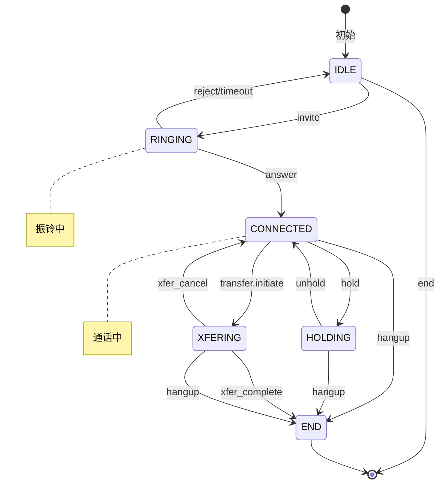
```mermaid
stateDiagram-v2
    [*] --> IDLE: 初始
    
    IDLE --> RINGING: invite
    IDLE --> [*]: end
    
    RINGING --> CONNECTED: answer
    RINGING --> IDLE: reject/timeout
    
    CONNECTED --> HOLDING: hold
    CONNECTED --> XFERING: transfer.initiate
    CONNECTED --> END: hangup
    
    HOLDING --> CONNECTED: unhold
    HOLDING --> END: hangup
    
    XFERING --> CONNECTED: xfer_cancel
    XFERING --> END: xfer_complete
    XFERING --> END: hangup
    
    END --> [*]
    
    note right of RINGING
        振铃中
    end note
    
    note right of CONNECTED
        通话中
    end note
```

### 8.2 3PCC转接状态机

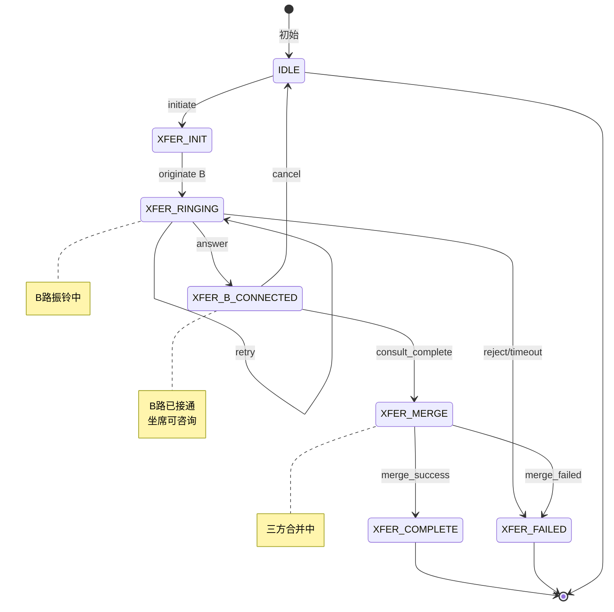
```mermaid
stateDiagram-v2
    [*] --> IDLE: 初始
    
    IDLE --> XFER_INIT: initiate
    
    XFER_INIT --> XFER_RINGING: originate B
    
    XFER_RINGING --> XFER_B_CONNECTED: answer
    XFER_RINGING --> XFER_FAILED: reject/timeout
    XFER_RINGING --> XFER_RINGING: retry
    
    XFER_B_CONNECTED --> XFER_MERGE: consult_complete
    XFER_B_CONNECTED --> IDLE: cancel
    
    XFER_MERGE --> XFER_COMPLETE: merge_success
    XFER_MERGE --> XFER_FAILED: merge_failed
    
    XFER_COMPLETE --> [*]
    XFER_FAILED --> [*]
    IDLE --> [*]
    
    note right of XFER_RINGING
        B路振铃中
    end note
    
    note right of XFER_B_CONNECTED
        B路已接通
        坐席可咨询
    end note
    
    note right of XFER_MERGE
        三方合并中
    end note
```

---

## 9. 部署架构

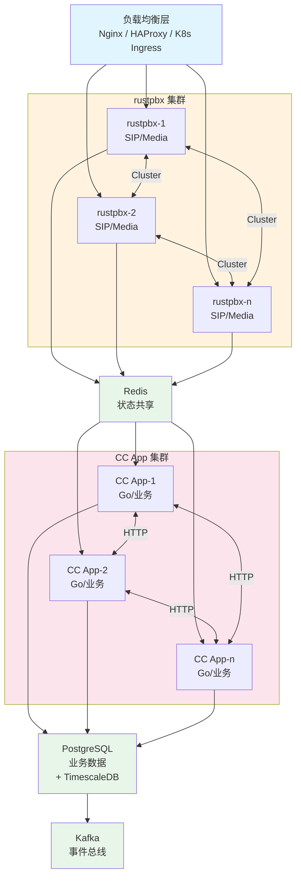
```mermaid
flowchart TB
    LB["负载均衡层<br/>Nginx / HAProxy / K8s Ingress"]
    
    subgraph RustpbxCluster["rustpbx 集群"]
        R1["rustpbx-1<br/>SIP/Media"]
        R2["rustpbx-2<br/>SIP/Media"]
        R3["rustpbx-n<br/>SIP/Media"]
    end
    
    Redis["Redis<br/>状态共享"]
    
    subgraph CCAppCluster["CC App 集群"]
        C1["CC App-1<br/>Go/业务"]
        C2["CC App-2<br/>Go/业务"]
        C3["CC App-n<br/>Go/业务"]
    end
    
    PG["PostgreSQL<br/>业务数据<br/>+ TimescaleDB"]
    Kafka["Kafka<br/>事件总线"]
    
    LB --> R1
    LB --> R2
    LB --> R3
    
    R1 <-->|Cluster| R2
    R2 <-->|Cluster| R3
    R1 <-->|Cluster| R3
    
    R1 --> Redis
    R2 --> Redis
    R3 --> Redis
    
    Redis --> C1
    Redis --> C2
    Redis --> C3
    
    C1 <-->|HTTP| C2
    C2 <-->|HTTP| C3
    C1 <-->|HTTP| C3
    
    C1 --> PG
    C2 --> PG
    C3 --> PG
    
    PG --> Kafka
    
    style LB fill:#e1f5fe
    style RustpbxCluster fill:#fff3e0
    style CCAppCluster fill:#fce4ec
    style Redis fill:#e8f5e9
    style PG fill:#e8f5e9
    style Kafka fill:#e8f5e9
```

---

## 10. 开发阶段规划

### 10.1 M1: 基础链路 (4周)
- [ ] **CC Addon HTTP REST API** - 供 CC App 调用的管理接口
  - [ ] 队列管理: enqueue/dequeue, list_members, stats
  - [ ] 坐席管理: login/logout, presence更新
  - [ ] 技能组: 增删改查
- [ ] 统一Queue调度引擎
- [ ] IVR → Queue → Agent 完整链路
- [ ] 基础Event Webhook
- [ ] CC App基础API (Go)
- [ ] CC WebPhone基础通话

### 10.2 M2: 核心能力 (4周)
- [ ] 技能组/技能匹配
- [ ] 3PCC转接 (REFER优先+回退)
- [ ] 坐席状态管理
- [ ] In-Dialog消息框架
- [ ] PCM流输出
- [ ] 班长监控 (监听/耳语/强插)
- [ ] **队列分配策略补齐** (看齐FS): ring-all, ring-progressively, least-talk-time, fewest-calls, random
- [ ] **坐席统计体系**: calls_answered, talk_time, ready_time 等字段
- [ ] **失败重试机制**: 拒接/忙线/未接延迟策略 (reject_delay, busy_delay, no_answer_delay)

### 10.3 M3: AI增强与体验优化 (3周)
- [ ] AI Bot框架 (SIP UA)
- [ ] AI IVR引擎
- [ ] ASR集成
- [ ] 话术推荐
- [ ] 上下文传递
- [ ] AI ↔ 人工无缝切换
- [ ] **排队体验优化**: 位置播报、预计等待时长计算
- [ ] **高级分配策略**: 基于技能权重、负载均衡的复合策略
- [ ] **多实例支持**: instance_id 字段设计，集群状态同步

### 10.4 M4: 运营与验收 (3周)
- [ ] 质检评分
- [ ] 实时看板
- [ ] 历史报表
- [ ] 全链路压测
- [ ] 故障演练
- [ ] 生产上线

---

## 11. 关键技术决策

| 决策项 | 选择 | 理由 | 与FS对比 |
|--------|------|------|---------|
| 转接策略 | REFER优先+3PCC回退 | 兼容性好，成功率高 | ✅ 优于FS基础桥接 |
| AI架构 | 独立SIP UA | 不影响核心链路，独立扩展 | ✅ FS无原生AI支持 |
| ASR流 | PCM流输出到CC App | 解耦媒体处理，支持多ASR引擎 | ✅ FS无原生ASR |
| 控制协议 | SIP MESSAGE (In-Dialog) + HTTP | 标准SIP+浏览器友好 | ✅ 优于FS命令行API |
| **通信通道** | **RWI + HTTP REST + Webhook** | 复用rustpbx已有能力 | ✅ 架构最简 |
| 队列策略 | 9种策略(补齐中) | 覆盖FS全部策略+SkillFirst | ⚠️ M2补齐ring-all等4种 |
| 坐席统计 | 扩展统计字段 | 支持least-talk-time等策略 | ⚠️ M2添加统计字段 |
| 状态同步 | Redis + Event Webhook | 实时+可靠 | ✅ 优于FS单实例 |
| 数据库 | PostgreSQL + TimescaleDB | 关系数据+时序数据 | ✅ 与FS ODBC等价 |

### 接口通道详细分工

```
┌─────────────────────────────────────────────────────────────┐
│                      CC App (Go)                            │
│  ┌──────────────┐  ┌──────────────┐  ┌──────────────┐      │
│  │   业务API    │  │  Webhook接收  │  │  RWI Client  │      │
│  │   (Gin)      │  │   (事件处理)  │  │  (可选)      │      │
│  └──────┬───────┘  └──────┬───────┘  └──────┬───────┘      │
└─────────┼─────────────────┼─────────────────┼──────────────┘
          │                 │                 │
          │ HTTP REST       │ Webhook         │ WebSocket
          │ (管理配置)       │ (事件通知)       │ (实时控制)
          │                 │                 │
┌─────────┼─────────────────┼─────────────────┼──────────────┐
│         ▼                 ▼                 ▼              │
│  ┌──────────────┐  ┌──────────────┐  ┌──────────────┐      │
│  │  HTTP Server │  │  Webhook     │  │  RWI Server  │      │
│  │  (Addon新增) │  │  (已有)      │  │  (已有)      │      │
│  └──────────────┘  └──────────────┘  └──────────────┘      │
│                                                             │
│                    CC Addon (Rust)                          │
│              (Queue / 3PCC / MESSAGE)                       │
└─────────────────────────────────────────────────────────────┘
```

**各通道具体职责：**

| 通道 | 方向 | 典型调用 | 频率 |
|------|------|---------|------|
| **RWI** | CC App ↔ Addon | originate, answer, bridge, transfer | 高（通话中） |
| **HTTP REST** | CC App → Addon | queue.enqueue, agent.login, skill.create | 中（管理操作） |
| **Webhook** | Addon → CC App | call.answered, queue.joined, agent.connected | 高（事件流） |
| **SIP MESSAGE** | WebPhone ↔ rustpbx | transfer.initiate, 3pcc.invite | 中（坐席操作） |

---

## 12. 与 FreeSWITCH mod_callcenter 对比及补齐计划

> 参考: `docs/cc_vs_freeswitch_comparison.md` 详细对比分析

### 12.1 功能对比矩阵

| 功能维度 | FreeSWITCH | rustpbx CC (当前设计) | 差距 | 优先级 |
|---------|-----------|---------------------|------|--------|
| **队列分配策略** | 9种 | 5种 | ⚠️ 缺4种 | P1 |
| **坐席统计字段** | 完整(calls_answered等) | 基础状态 | ⚠️ 不完整 | P1 |
| **失败重试机制** | 延迟惩罚策略 | 简单重试 | ⚠️ 不完善 | P2 |
| **多实例支持** | instance_id | 单机 | ⚠️ 待设计 | P2 |
| **监控/质检** | uuid-standby基础 | 完整班长功能 | ✅ 领先 | - |
| **AI集成** | 无原生 | AI优先架构 | ✅ 领先 | - |
| **3PCC转接** | 基础 | REFER+3PCC回退 | ✅ 领先 | - |
| **WebPhone** | 需自研 | 内置SIP MESSAGE | ✅ 领先 | - |

### 12.2 需补齐功能详解

#### 12.2.1 队列分配策略 (P1-重要)

**FreeSWITCH 支持策略 (9种):**
```c
1. longest-idle-agent          // 最长空闲 (默认)
2. agent-with-least-talk-time  // 最少通话时长
3. agent-with-fewest-calls     // 最少接通次数
4. ring-all                    // 全体振铃
5. ring-progressively          // 渐进式振铃
6. top-down                    // 顺序(按tier level/position)
7. round-robin                 // 轮询
8. random                      // 随机
9. sequentially-by-agent-order // 按坐席顺序
```

**当前设计 (5种):**
- Sequential, Parallel, LongestIdle, RoundRobin, SkillFirst

**需补充 (4种):**
| 策略 | 说明 | 实现要点 |
|-----|------|---------|
| `ring-all` | 同时呼叫所有就绪坐席 | 并发originate，谁先接给谁 |
| `ring-progressively` | 渐进增加振铃人数 | 先呼叫2人，超时再呼叫2人 |
| `least-talk-time` | 今日通话时长最少优先 | 需累计talk_time字段 |
| `fewest-calls` | 今日接通次数最少优先 | 需累计calls_answered字段 |
| `random` | 随机选择 | 简单随机算法 |

**实现建议 (Rust):**
```rust
// src/addons/queue/services/dispatch.rs
pub enum DispatchStrategy {
    Sequential,
    Parallel,
    LongestIdle,
    RoundRobin,
    SkillFirst,
    // 新增
    RingAll,
    RingProgressively { initial_count: usize, add_interval_secs: u32 },
    LeastTalkTime,
    FewestCalls,
    Random,
}

impl DispatchStrategy {
    pub fn select_agents(&self, agents: &[Agent], count: usize) -> Vec<Agent> {
        match self {
            DispatchStrategy::RingAll => agents.iter().filter(|a| a.is_ready()).cloned().collect(),
            DispatchStrategy::LeastTalkTime => {
                let mut list: Vec<_> = agents.iter().filter(|a| a.is_ready()).collect();
                list.sort_by_key(|a| a.stats.talk_time);
                list.into_iter().take(count).cloned().collect()
            }
            // ... 其他策略
        }
    }
}
```

#### 12.2.2 坐席统计字段 (P1-重要)

**参考 FS agents 表:**
```sql
-- 需添加到 CC App PostgreSQL schema
ALTER TABLE agents ADD COLUMN IF NOT EXISTS calls_answered INTEGER DEFAULT 0;
ALTER TABLE agents ADD COLUMN IF NOT EXISTS talk_time INTEGER DEFAULT 0;      -- 秒
ALTER TABLE agents ADD COLUMN IF NOT EXISTS ready_time INTEGER DEFAULT 0;     -- 秒
ALTER TABLE agents ADD COLUMN IF NOT EXISTS last_offered_call TIMESTAMP;      -- 最后一次分配尝试
ALTER TABLE agents ADD COLUMN IF NOT EXISTS last_bridge_start TIMESTAMP;      -- 最后一次通话开始
ALTER TABLE agents ADD COLUMN IF NOT EXISTS last_bridge_end TIMESTAMP;        -- 最后一次通话结束
ALTER TABLE agents ADD COLUMN IF NOT EXISTS no_answer_count INTEGER DEFAULT 0; -- 连续未接次数
```

**统计更新时机:**
| 字段 | 更新时机 | 计算方式 |
|-----|---------|---------|
| calls_answered | 通话结束后 | +1 |
| talk_time | 通话结束后 | last_bridge_end - last_bridge_start |
| ready_time | 状态变为Ready时 | 累计就绪时长 |
| last_offered_call | 分配坐席时 | NOW() |
| last_bridge_start | 坐席接听时 | NOW() |
| last_bridge_end | 通话结束时 | NOW() |
| no_answer_count | 未接时+1，接听时清零 | - |

#### 12.2.3 失败重试与延迟策略 (P2-中等)

**FreeSWITCH 配置参数:**
```xml
<agent name="1000" 
       max-no-answer="3"           <!-- 最大未接次数，超过转On Break -->
       wrap-up-time="10"           <!-- 整理时长(秒) -->
       reject-delay-time="10"      <!-- 拒接后延迟(秒) -->
       busy-delay-time="60"        <!-- 忙线后延迟(秒) -->
       no-answer-delay-time="30"   <!-- 未接后延迟(秒) -->
/>
```

**我们的设计:**
```rust
// src/addons/queue/models/agent.rs
pub struct AgentPenaltyConfig {
    pub max_no_answer: u32,           // 最大未接次数
    pub wrap_up_time_secs: u32,       // 整理时长
    pub reject_delay_secs: u32,       // 拒接延迟
    pub busy_delay_secs: u32,         // 忙线延迟
    pub no_answer_delay_secs: u32,    // 未接延迟
}

pub struct AgentState {
    pub config: AgentPenaltyConfig,
    pub no_answer_count: u32,         // 当前未接计数
    pub next_available_time: Timestamp, // 下次可分配时间
}

impl AgentState {
    /// 计算分配失败后下次可分配时间
    pub fn calculate_next_available(&mut self, reason: FailReason) {
        let delay = match reason {
            FailReason::Rejected => self.config.reject_delay_secs,
            FailReason::Busy => self.config.busy_delay_secs,
            FailReason::NoAnswer => {
                self.no_answer_count += 1;
                if self.no_answer_count >= self.config.max_no_answer {
                    // 超过最大未接次数，转 On Break
                    self.status = AgentStatus::OnBreak;
                }
                self.config.no_answer_delay_secs
            }
        };
        self.next_available_time = now() + Duration::from_secs(delay as u64);
    }
}
```

#### 12.2.4 排队体验功能 (P2-中等)

**FreeSWITCH 支持:**
```xml
<queue name="support">
    <param name="moh-sound" value="$${hold_music}"/>           <!-- 保持音乐 -->
    <param name="announce-sound" value="queue_position.wav"/>   <!-- 位置提示音 -->
    <param name="announce-frequency" value="30"/>              <!-- 播报间隔(秒) -->
</queue>
```

**我们的设计:**
```rust
// src/call/app/queue_config.rs
pub struct QueueExperienceConfig {
    pub moh_sound: String,                    // 保持音乐文件
    pub position_announcement_enabled: bool,  // 启用位置播报
    pub announcement_interval_secs: u32,      // 播报间隔
    pub estimated_wait_enabled: bool,         // 启用预计等待时长
}

// 位置播报实现
pub async fn announce_position(
    &self,
    member: &QueueMember,
    position: usize,
) -> Result<()> {
    let audio = self.build_position_audio(position).await?;
    self.play_to_member(member, &audio).await
}

// 预计等待时长计算 (基于历史数据)
pub fn estimate_wait_time(&self, queue: &Queue, position: usize) -> Duration {
    let avg_answer_time = queue.stats.asa.as_secs() as usize; // 平均应答速度
    Duration::from_secs((position * avg_answer_time) as u64)
}
```

#### 12.2.5 多实例/集群支持 (P2-长期)

**FreeSWITCH 设计:**
```c
// instance_id 字段区分不同FS实例
instance_id = "single_box"  // 默认单实例
// 多实例共享数据库时，各实例只处理自己的agent
```

**我们的设计:**
```rust
// src/models/cluster.rs
pub struct ClusterConfig {
    pub instance_id: String,          // 实例ID
    pub redis_url: String,            // 共享Redis
    pub shared_db_url: String,        // 共享PostgreSQL
}

// Agent/Member 表添加 instance_id 字段
pub struct Agent {
    pub name: String,
    pub instance_id: String,          // 所属实例
    // ...
}

// 调度时只选择当前实例或指定实例的坐席
impl QueueDispatchEngine {
    pub fn filter_by_instance(&self, agents: &[Agent]) -> Vec<Agent> {
        agents.iter()
            .filter(|a| a.instance_id == self.config.instance_id)
            .cloned()
            .collect()
    }
}
```

### 12.3 数据模型参考 (FS Schema)

```sql
-- members (排队成员) - 对应我们的 QueueEntry
CREATE TABLE members (
    queue VARCHAR(255),
    instance_id VARCHAR(255),
    uuid VARCHAR(255),
    cid_number VARCHAR(255),
    cid_name VARCHAR(255),
    joined_epoch INTEGER,        -- 入队时间
    bridge_epoch INTEGER,        -- 接通时间
    abandoned_epoch INTEGER,     -- 放弃时间
    base_score INTEGER,          -- 基础优先级
    skill_score INTEGER,         -- 技能优先级
    serving_agent VARCHAR(255),  -- 服务坐席
    state VARCHAR(255)           -- Waiting/Trying/Answered/Abandoned
);

-- agents (坐席)
CREATE TABLE agents (
    name VARCHAR(255),
    instance_id VARCHAR(255),
    type VARCHAR(255),           -- Callback / uuid-standby
    contact VARCHAR(1024),       -- 呼叫地址
    status VARCHAR(255),         -- Available/On Break/Logged Out
    state VARCHAR(255),          -- Waiting/Receiving/In a queue call
    max_no_answer INTEGER DEFAULT 0,
    wrap_up_time INTEGER DEFAULT 0,
    reject_delay_time INTEGER DEFAULT 0,
    busy_delay_time INTEGER DEFAULT 0,
    no_answer_delay_time INTEGER DEFAULT 0,
    last_bridge_start INTEGER,
    last_bridge_end INTEGER,
    last_offered_call INTEGER,
    calls_answered INTEGER DEFAULT 0,
    talk_time INTEGER DEFAULT 0,
    ready_time INTEGER DEFAULT 0
);

-- tiers (队列-坐席关系)
CREATE TABLE tiers (
    queue VARCHAR(255),
    agent VARCHAR(255),
    state VARCHAR(255),          -- Ready/Active inbound/No Answer
    level INTEGER DEFAULT 1,     -- 层级
    position INTEGER DEFAULT 1   -- 位置
);
```

### 12.4 补齐优先级总结

| 优先级 | 功能项 | 预计工作量 | 归属阶段 |
|-------|--------|-----------|---------|
| P1 | 队列策略(ring-all等4种) | 3-5天 | M2 |
| P1 | 坐席统计字段 | 2-3天 | M2 |
| P2 | 失败重试延迟机制 | 3-5天 | M2 |
| P2 | 排队位置播报 | 2-3天 | M3 |
| P2 | 多实例支持 | 5-7天 | M3 |

---

## 13. 风险与缓解

| 风险 | 影响 | 缓解措施 |
|------|------|----------|
| ASR延迟高 | 用户体验差 | 支持多ASR引擎，本地+云端混合 |
| 3PCC失败 | 转接失败 | 完善的回滚机制，自动重试 |
| 状态不一致 | 通话错乱 | 单call单owner，幂等设计 |
| AI Bot故障 | 无法接待 | 自动降级到传统IVR |
| 高并发 | 系统瓶颈 | 水平扩展，负载均衡 |
| **FS功能补齐延期** | 无法满足传统CC用户 | 优先实现ring-all/least-talk-time等核心策略，渐进完善 |
| **数据迁移兼容** | 无法对接现有FS用户 | 设计兼容FS schema的数据模型，支持平滑迁移 |
| **接口职责混淆** | 开发混乱，维护困难 | 严格区分：RWI实时控制、HTTP管理配置、Webhook事件通知 |

---

## 14. 参考文档

1. **本文档**: `docs/cc_ai_first_architecture.md` - AI优先呼叫中心开发方案
2. **FS对比分析**: `docs/cc_vs_freeswitch_comparison.md` - 与 FreeSWITCH mod_callcenter 详细对比
3. **原始需求**: `docs/cc.md` - 呼叫中心需求与技术方案
4. **RWI接口**: `docs/rwi.md` - Real-time WebSocket Interface 文档
5. **API集成**: `docs/api_integration_guide.md` - HTTP API 集成指南
